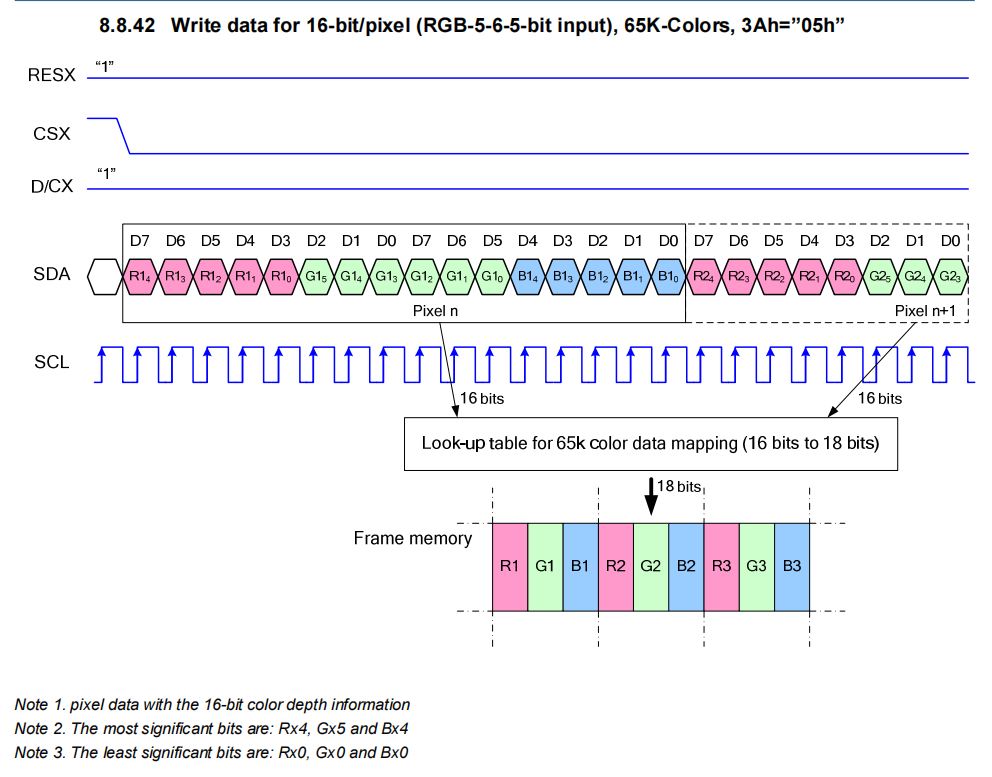
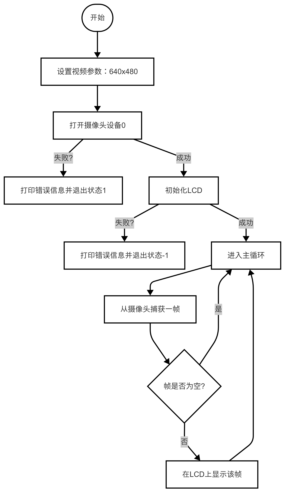
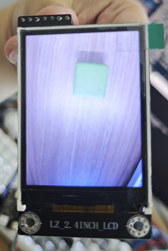

# LCD 显示屏使用指南

## 章节说明

本章节主要是演示如何使用 LockAI 视频流的读取，同时使用 LCD 模块对图像进行显示。

## 1. 基本知识讲解

### 1.1 LCD 硬件接口说明

可在2.4寸液晶模块背面查看。

| 引脚名称 | 功能描述 |
| :--- | :------- |
| D/C | 指令/数据选择端，L:指令，H:数据 |
| RESET | 复位信号线，低电平有效 |
| SPI_MOSI | SPI数据输入信号线 |
| SPI_CLK  | SPI时钟信号线 |
| SPI_CS | SPI片选信号线，低电平有效 |
| GND |电源地引脚 |
| 5V | 5V电源输入引脚|

* 注意： 在本次实验中没有使用SPI_CS引脚，CS引脚接地即可，即默认选中设备。

### 1.2 LCD 通讯协议介绍

LCD型号为ST7789V，采用SPI通信方式，数据传输协议如下：

`4-Line Serial Interface => 16-bit/pixel(RGB 5-6-5-bit input)，65K-Color，3Ah="05h"`

数据传输时序图如下：



* 注意：在实际使用凌智视觉LCD模块时，无需关注底层实现。

## 2. API文档

### 2.1 头文件

```cpp
#include <lockzhiner_vision_module/periphery/lcd/lcd_driver.h>
```

### 2.2 初始化LCD模块

```cpp
int lcd_init();
```

功能：初始化LCD模块
参数：无
返回值 ：无

```cpp
void lcd_display_opencv_image(const cv::Mat& frame);
```

功能：传入一个 cv::Mat 类型的图像数据，将图像显示在LCD上。
参数：OpenCV 图像
返回值：无

## 3. 综合代码解析

### 3.1 流程图


### 3.2 代码解析

- 初始化摄像头

```cpp
cv::VideoCapture cap;
const int width = 640;
const int height = 480;
cap.set(cv::CAP_PROP_FRAME_WIDTH, width);
cap.set(cv::CAP_PROP_FRAME_HEIGHT, height);
```

- 初始化LCD

```cpp
if (lcd_init() < 0) {
    std::cerr << "LCD initialization failed" << std::endl;
    return -1;
  }
```

- 逐帧捕获图像

```cpp
while (true) {
    cv::Mat frame;
    cap >> frame;
    if (frame.empty()) {
        std::cerr << "Warning: Couldn't read a frame from the camera."
                    << std::endl;
        continue;
    }
}
```

- 传输图像到LCD

```cpp
lcd_display_opencv_image(frame);
```

### 3.3 完整代码实现

```cpp
#include <lockzhiner_vision_module/periphery/lcd/lcd_driver.h>

#include <iostream>
#include <opencv2/opencv.hpp>
int main() {
  // 设置视频采集参数（640x480分辨率）
  cv::VideoCapture cap;
  cap.set(cv::CAP_PROP_FRAME_WIDTH, 640);
  cap.set(cv::CAP_PROP_FRAME_HEIGHT, 480);

  // 尝试打开摄像头设备（0号摄像头）
  if (!cap.open(0)) {
    std::cerr << "Camera failed to open\n";
    return 1;
  }
  if (lcd_init() < 0) {
    std::cerr << "LCD initialization failed" << std::endl;
    return -1;
  }
  cv::Mat frame;
  while (true) {
    cap >> frame;  // 从摄像头捕获一帧图像
    if (frame.empty()) continue;
    lcd_display_opencv_image(frame);
  }
}
```

## 4. 编译过程

### 4.1 编译环境搭建

- 请确保你已经按照 [开发环境搭建指南](../../../../docs/introductory_tutorial/cpp_development_environment.md) 正确配置了开发环境。
- 同时以正确连接开发板。

### 4.2 Cmake介绍

```cmake
# CMake最低版本要求  
cmake_minimum_required(VERSION 3.10)  

project(test_lcd)

set(CMAKE_CXX_STANDARD 17)
set(CMAKE_CXX_STANDARD_REQUIRED ON)

# 定义项目根目录路径
set(PROJECT_ROOT_PATH "${CMAKE_CURRENT_SOURCE_DIR}/../..")
message("PROJECT_ROOT_PATH = " ${PROJECT_ROOT_PATH})

include("${PROJECT_ROOT_PATH}/toolchains/arm-rockchip830-linux-uclibcgnueabihf.toolchain.cmake")

# 定义 OpenCV SDK 路径
set(OpenCV_ROOT_PATH "${PROJECT_ROOT_PATH}/third_party/opencv-mobile-4.10.0-lockzhiner-vision-module")
set(OpenCV_DIR "${OpenCV_ROOT_PATH}/lib/cmake/opencv4")
find_package(OpenCV REQUIRED)
set(OPENCV_LIBRARIES "${OpenCV_LIBS}")
# 定义 LockzhinerVisionModule SDK 路径
set(LockzhinerVisionModule_ROOT_PATH "${PROJECT_ROOT_PATH}/third_party/lockzhiner_vision_module_sdk")
set(LockzhinerVisionModule_DIR "${LockzhinerVisionModule_ROOT_PATH}/lib/cmake/lockzhiner_vision_module")
find_package(LockzhinerVisionModule REQUIRED)


add_executable(Test_LCD Test_LCD.cc)
target_include_directories(Test_LCD PRIVATE ${LOCKZHINER_VISION_MODULE_INCLUDE_DIRS})
target_link_libraries(Test_LCD PRIVATE ${OPENCV_LIBRARIES} ${LOCKZHINER_VISION_MODULE_LIBRARIES})

install(
    TARGETS Test_LCD
    RUNTIME DESTINATION .  
)
```

### 4.3 编译项目

使用 Docker Destop 打开 LockzhinerVisionModule 容器并执行以下命令来编译项目

```bash
# 进入Demo所在目录
cd /LockzhinerVisionModuleWorkSpace/LockzhinerVisionModule/Cpp_example/A06_LCD
# 创建编译目录
rm -rf build && mkdir build && cd build
# 配置交叉编译工具链
export TOOLCHAIN_ROOT_PATH="/LockzhinerVisionModuleWorkSpace/arm-rockchip830-linux-uclibcgnueabihf"
# 使用cmake配置项目
cmake ..
# 执行编译项目
make -j8 && make install
```

在执行完上述命令后，会在build目录下生成可执行文件。

## 5. 例程运行示例

### 5.1 准备工作

- 请确保你以按照前文要求链接好设备

### 5.2 运行过程

在凌智视觉模块中输入以下命令：

```shell
chmod 777 Test_LCD
./Test_LCD
```

### 5.3 运行效果



## 6. 总结

本文档介绍了如何在LockAI上使用LCD模块，并通过OpenCV读取摄像头模块的视频流并显示在LCD上。通过本功能可以很好的在脱机的时候显示图像画面，大大增加了调试的便利性。
