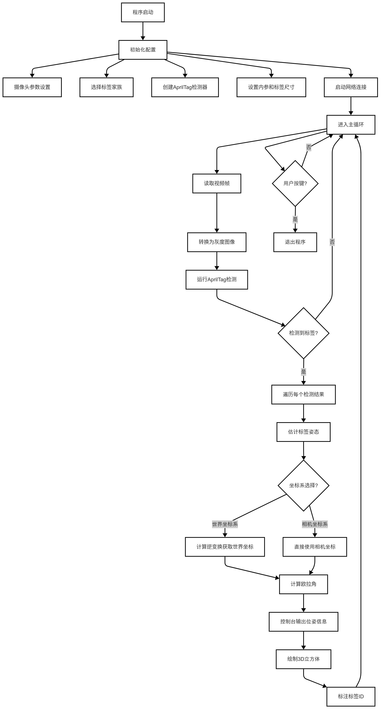
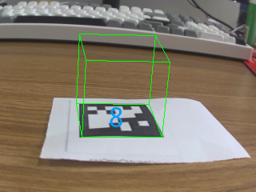

# Apriltag检测识别

本章基于 Lockzhiner Vision Module 和 OpenCV 配合 Apriltag 库（C语言） 实现对 Apriltag 标签的检测和识别，同时通过标签信息解算出标签姿态。

## 1. 基本知识介绍

### 1.1 Apriltag 基本知识介绍

AprilTag 是一种基于视觉的二维条码标记系统，广泛应用于机器人定位、无人机导航、增强现实（AR）等领域。它通过检测特定的黑白图案来确定目标的位置和方向，具有高鲁棒性和快速识别能力。

### 1.2 AprilTag 的家族

AprilTag 的标记分为不同的“家族”，每个家族对应不同的编码规则和适用场景。常见的家族包括：

| 家族名称       | 编码能力（ID 范围） | 特点                                      | 适用场景                                |
|----------------|-------------------|------------------------------------------|----------------------------------------|
| **tag16h5**    | 0~29             | 最小的标记（4x4 方块），识别速度快，抗干扰能力较弱 | 简单快速的近距离检测                   |
| **tag25h9**    | 0~341            | 中等规模（5x5 方块），平衡速度与鲁棒性         | 中等距离/复杂环境下的检测              |
| **tag36h11**   | 0~586            | 最大的标记（6x6 方块），信息量大，抗干扰能力强 | 高精度需求（机器人导航、无人机）       |
| **tagCircle21h7** | 0~20          | 圆形标记，适合特定形状需求                     | 特殊场景（如圆形目标检测）             |
| **tagStandard41h12** | 0~1000+      | 标准化家族，支持更多 ID，适用于大规模部署       | 需要大量不同标签的场景（如仓储管理）   |

### 1.3 AprilTag 的工作原理

AprilTag 的检测流程分为以下几个步骤：

- 图像预处理：
将输入图像转换为灰度图，并进行降采样（quad_decimate 参数控制）。
使用梯度检测（如 Sobel 算子）提取边缘信息。
- 边缘检测与聚类：
通过聚类算法（如 Felzenszwalb 算法）将相似梯度的边缘点分组，形成候选区域。
- 候选区域筛选：
检测矩形或近似矩形区域（四边形）作为潜在的 AprilTag 标签。
通过几何验证（如边长比例、角度）过滤误检。
- 解码与 ID 识别：
对候选区域进行单应性变换（Homography），将其映射为标准正方形。
解码内部黑白方块的模式，提取标签的 ID 和校验位。
- 姿态估计：
使用 PnP（Perspective-n-Point）算法，基于标签的 3D 模型和检测到的 2D 角点，计算相机与标签的相对位姿（旋转矩阵 R 和平移向量 T）。

## 2. API 文档

### 2.1 AprilTag检测器类

#### 2.1.1 头文件

```cpp
#include "apriltag_detector.h"
```

#### 2.1.2 检测器初始化函数

```cpp
int init_apriltag_detector(const char* tag_family, 
                          double tag_size,
                          double fx, double fy, 
                          double cx, double cy,
                          apriltag_context_t* ctx);
```

- 功能​​：初始化AprilTag检测系统
- 参数：
  - tag_family: 标签家族名称("tag36h11"/"tag25h9"等)
  - tag_size: 标签物理尺寸（米）
  - ctx: 检测器上下文指针
  - fx/fy: 相机焦距（默认值基于OV2640）
  - cx/cy: 光学中心（默认320x240分辨率）
- 返回值：
  - 0: 成功
  - -1: 初始化失败

#### 2.1.3 实时检测

```cpp
int detect_apriltags(apriltag_context_t* ctx, 
                    cv::Mat& frame,
                    apriltag_result_list* results,
                    bool refine_edges = true,
                    int num_threads = 1);
```

- 功能：执行实时检测与姿态解算
- 参数：
  - ctx: 初始化后的上下文
  - frame: BGR格式输入帧（自动转换为灰度）
  - results: 检测结果存储结构体
  - refine_edges: 边缘优化开关
  - num_threads: 并行计算线程数
- 返回值：
  - ≥0: 检测到的标签数量
  - -1: 检测失败

#### 2.1.4 资源释放

```cpp
void release_apriltag_detector(apriltag_context_t* ctx);
```

- 功能：释放检测器相关资源
- 参数：
  - ctx:需要释放的上下文指着

### 2.2 坐标转换模块

#### 2.2.1 世界坐标转换

```cpp
void convert_to_world_coords(const apriltag_pose_t& pose,
                            cv::Mat& translation,
                            cv::Mat& rotation,
                            bool zyx_order = true);
```

- 功能：将姿态数据转换为世界坐标系
- 参数：
  - pose: 原始检测姿态数据
  - translation: 输出平移向量(3x1 double)
  - rotation: 输出旋转矩阵/欧拉角
  - zyx_order: 欧拉角计算顺序（默认Z-Y-X）
- 输出格式：
  - 当zyx_order=true时，rotation为3x1欧拉角（度）
  - 否则为3x3旋转矩阵

### 2.3 可视化模块

#### 2.3.1 增强现实立方体

```cpp
void draw_pose_cube(cv::Mat& frame,
                   const apriltag_pose_t& pose,
                   double tag_size,
                   double fx, double fy,
                   double cx, double cy,
                   cv::Scalar color = cv::Scalar(0, 255, 0));
```

- 功能​​：绘制3D定位立方体
- 参数：
  - frame: 目标图像帧
  - pose: 已解算的姿态数据
  - tag_size: 标签实际尺寸
  - fx/fy/cx/cy: 相机内参
  - color: 线条颜色（默认绿色）

#### 2.3.2 标签ID标注

```cpp
void draw_tag_identification(cv::Mat& frame,
                            const apriltag_detection_t& det,
                            int font_face = cv::FONT_HERSHEY_SCRIPT_SIMPLEX,
                            double font_scale = 1.0,
                            cv::Scalar color = cv::Scalar(255, 153, 0));
```

- 功能​​：在标签中心标注ID号
- 参数：
  - det: 检测结果数据
  - font_face: OpenCV字体类型
  - font_scale: 字体缩放因子
  - color: 文本颜色（默认橙色）

## 3. 代码解析

### 3.1 流程图


### 3.2 核心代码解析

#### 3.2.1. 检测器初始化

```cpp
// 配置参数结构体
AprilTagConfig config;
config.detection.family = TAG36H11;
config.detection.size = 0.12;  // 标签物理尺寸12cm
config.camera.fx = 848.469;    // 相机内参
config.camera.fy = 847.390;

// 初始化检测器上下文
apriltag_context_t ctx;
if(init_apriltag_detector(&ctx, config) != 0) {
    cerr << "检测器初始化失败" << endl;
    exit(-1);
}
```

​​实现原理​​：

- 加载指定标签家族描述文件
- 创建apriltag_detector内存结构
- 初始化相机参数矩阵
- 预分配结果缓冲区

#### 3.2.2 图像预处理

```cpp
cv::Mat gray;
cvtColor(frame, gray, COLOR_BGR2GRAY);  // RGB转灰度

// 构建AprilTag专用图像结构
image_u8_t im = {
    .width = gray.cols,
    .height = gray.rows,
    .stride = gray.cols,
    .buf = gray.data
};
```

#### 3.2.3 检测执行

```cpp
zarray_t* detections = apriltag_detector_detect(ctx.td, &im);
int count = zarray_size(detections);  // 检测到的标签数量

for (int i = 0; i < count; i++) {
    apriltag_detection_t* det;
    zarray_get(detections, i, &det);
    
    // 姿态估计
    apriltag_pose_t pose;
    estimate_tag_pose(&ctx.info, det, &pose);
}
```

关键流程​​：

- 四元数检测：通过梯度分析寻找候选四边形
- 解码验证：对候选区域进行二进制解码
- 位姿解算：使用正交迭代法求解PnP问题

#### 3.2.4 坐标转换

```cpp
if(config.world_coord) {
    cv::Mat pos_world, euler_angles;
    convert_to_world_coords(pose, pos_world, euler_angles);
    pos_world += ctx.config.world_offset;
}
```

#### 3.2.5 可视化渲染

```cpp
// 绘制3D立方体
draw_pose_cube(frame, pose, ctx.config.detection.size, 
              ctx.config.camera.fx, ctx.config.camera.fy,
              ctx.config.camera.cx, ctx.config.camera.cy);

// 添加调试信息
if(debug_mode) {
    overlay_debug_info(frame, {
        .id = det->id,
        .translation = pos_world,
        .euler_angles = euler_angles
    });
}
```

### 3.3 完整代码实现

```cpp
#include <lockzhiner_vision_module/edit/edit.h>

#include </usr/local/include/eigen3/Eigen/Dense>
#include <iostream>
#include <opencv2/core/eigen.hpp>

#include "opencv2/opencv.hpp"

// === 可选标签家族头文件（取消注释对应家族以切换） ===
extern "C" {
#include "apriltag.h"
#include "apriltag_pose.h"

// 可选标签家族（根据需求取消注释）：
// 1. tag36h11（默认） - 高鲁棒性 36x36 黑白图案
#include "tag36h11.h"

// 2. tag25h9 - 25x25 黑白图案
// #include "tag25h9.h"

// 3. tag16h5 - 16x16 黑白图案
// #include "tag16h5.h"

// 4. tagCircle21h7 - 圆形标签
// #include "tagCircle21h7.h"

// 5. tagCircle49h12 - 大尺寸圆形标签
// #include "tagCircle49h12.h"

// 6. tagStandard41h12 - 标准尺寸标签
// #include "tagStandard41h12.h"

// 7. tagStandard52h13 - 大尺寸标准标签
// #include "tagStandard52h13.h"

// 8. tagCustom48h12 - 自定义标签
// #include "tagCustom48h12.h"
}

// 手动投影函数
void manualProjectPoint(const cv::Point3d &point, const cv::Mat &R,
                        const cv::Mat &t, cv::Point2d &projected, double fx,
                        double fy, double cx, double cy) {
  Eigen::Vector4d point_3d(point.x, point.y, point.z, 1);

  Eigen::Matrix<double, 3, 4> Rt;
  for (int i = 0; i < 3; ++i) {
    for (int j = 0; j < 3; ++j) {
      Rt(i, j) = R.at<double>(i, j);
    }
    Rt(i, 3) = t.at<double>(i, 0);
  }

  Eigen::Vector3d proj_point = Rt * point_3d;
  double x = proj_point(0) / proj_point(2);
  double y = proj_point(1) / proj_point(2);

  projected.x = fx * x + cx;
  projected.y = fy * y + cy;
}

// Function to draw a 3D cube around the detected tag
void drawCube(cv::Mat &frame, const apriltag_pose_t &pose,
              const apriltag_detection_info_t &info) {
  double size = info.tagsize / 2.0;
  std::vector<cv::Point3d> points = {
      {-size, -size, 0},         {size, -size, 0},
      {size, size, 0},           {-size, size, 0},
      {-size, -size, -2 * size}, {size, -size, -2 * size},
      {size, size, -2 * size},   {-size, size, -2 * size}};

  cv::Mat rvec(3, 3, CV_64FC1, pose.R->data);  // Rotation matrix
  cv::Mat tvec(3, 1, CV_64FC1, pose.t->data);  // Translation vector

  std::vector<cv::Point2d> imgPoints(points.size());
  for (size_t i = 0; i < points.size(); ++i) {
    manualProjectPoint(points[i], rvec, tvec, imgPoints[i], info.fx, info.fy,
                       info.cx, info.cy);
  }

  // Draw lines of the cube
  for (int i = 0; i < 4; ++i) {
    cv::line(frame, imgPoints[i], imgPoints[(i + 1) % 4], cv::Scalar(0, 255, 0),
             1);  // Top face
    cv::line(frame, imgPoints[i + 4], imgPoints[(i + 1) % 4 + 4],
             cv::Scalar(0, 255, 0),
             1);  // Bottom face
    cv::line(frame, imgPoints[i], imgPoints[i + 4], cv::Scalar(0, 255, 0),
             1);  // Vertical lines
  }
}

int main() {
  // === 可配置参数（通过注释说明） ===

  // 标签家族选择（需配合 extern "C" 中的头文件使用）
  // 1. tag36h11 - 已包含
  // 2. tag25h9 - 取消注释 #include "tag25h9.h" 并修改 tf = tag25h9_create()
  // 3. tag16h5 - 取消注释 #include "tag16h5.h" 并修改 tf = tag16h5_create()
  // 其他同理...

  // 标签尺寸（单位：米）
  double tag_size = 0.146 - 0.012 * 4;  // 根据实际标签尺寸修改

  // 相机内参（需根据实际相机标定结果修改）
  double fx = 848.469;  // 焦距x
  double fy = 847.390;  // 焦距y
  double cx = 160;      // 光心x（图像宽度的一半）
  double cy = 120;      // 光心y（图像高度的一半）

  // 检测器配置参数
  int num_threads = 1;       // 使用的线程数
  double decimate = 2.0;     // 输入图像降采样因子
  double blur = 0.0;         // 模糊强度
  bool refine_edges = true;  // 是否优化边缘检测

  // 坐标系选择（true=世界坐标系，false=相机坐标系）
  bool use_world_coords = true;

  // === 初始化 ===
  cv::VideoCapture cap;
  cap.set(cv::CAP_PROP_FRAME_WIDTH, 320);
  cap.set(cv::CAP_PROP_FRAME_HEIGHT, 240);
  if (!cap.open(0)) {
    std::cerr << "Couldn't open video capture device" << std::endl;
    return -1;
  }

  // 创建标签家族实例（根据选择切换函数）
  // 默认使用 tag36h11：
  apriltag_family_t *tf = tag36h11_create();
  // 切换到 tag25h9：
  // apriltag_family_t *tf = tag25h9_create();
  // 切换到 tag16h5：
  // apriltag_family_t *tf = tag16h5_create();
  // 其他同理...

  apriltag_detector_t *td = apriltag_detector_create();
  apriltag_detector_add_family(td, tf);
  td->quad_decimate = decimate;
  td->quad_sigma = blur;
  td->nthreads = num_threads;
  td->refine_edges = refine_edges;

  apriltag_detection_info_t info;
  info.tagsize = tag_size;
  info.fx = fx;
  info.fy = fy;
  info.cx = cx;
  info.cy = cy;

  lockzhiner_vision_module::edit::Edit edit;
  if (!edit.StartAndAcceptConnection()) {
    std::cerr << "Error: Failed to start and accept connection." << std::endl;
    return EXIT_FAILURE;
  }

  // === 主循环 ===
  cv::Mat frame, gray;
  while (true) {
    cap >> frame;
    cv::cvtColor(frame, gray, cv::COLOR_BGR2GRAY);

    image_u8_t im = {.width = gray.cols,
                     .height = gray.rows,
                     .stride = gray.cols,
                     .buf = gray.data};

    zarray_t *detections = apriltag_detector_detect(td, &im);

    for (int i = 0; i < zarray_size(detections); i++) {
      apriltag_detection_t *det;
      zarray_get(detections, i, &det);
      info.det = det;
      apriltag_pose_t pose;
      estimate_tag_pose(&info, &pose);

      if (use_world_coords) {
        // 世界坐标系下的位置
        cv::Mat rvec(3, 3, CV_64FC1, pose.R->data);
        cv::Mat tvec(3, 1, CV_64FC1, pose.t->data);
        cv::Mat Pos = rvec.inv() * tvec;
        std::cout << "Tx: " << Pos.ptr<double>(0)[0] << std::endl;
        std::cout << "Ty: " << Pos.ptr<double>(1)[0] << std::endl;
        std::cout << "Tz: " << Pos.ptr<double>(2)[0] << std::endl;

        // 计算欧拉角（ZYX 顺序）
        double R11 = rvec.at<double>(0, 0), R12 = rvec.at<double>(0, 1),
               R13 = rvec.at<double>(0, 2);
        double R21 = rvec.at<double>(1, 0), R22 = rvec.at<double>(1, 1),
               R23 = rvec.at<double>(1, 2);
        double R31 = rvec.at<double>(2, 0), R32 = rvec.at<double>(2, 1),
               R33 = rvec.at<double>(2, 2);

        double roll = std::atan2(R32, R33);
        double pitch = std::asin(-R31);
        double yaw = std::atan2(R21, R11);

        std::cout << "Rx: " << roll * 180 / CV_PI << "°" << std::endl;
        std::cout << "Ry: " << pitch * 180 / CV_PI << "°" << std::endl;
        std::cout << "Rz: " << yaw * 180 / CV_PI << "°" << std::endl;
        std::cout << "-----------world--------------" << std::endl;
      } else {
        // 相机坐标系下的位置
        std::cout << "Tx: " << pose.t->data[0] << std::endl;
        std::cout << "Ty: " << pose.t->data[1] << std::endl;
        std::cout << "Tz: " << pose.t->data[2] << std::endl;

        cv::Mat rvec(3, 3, CV_64FC1, pose.R->data);
        double R11 = rvec.at<double>(0, 0), R12 = rvec.at<double>(0, 1),
               R13 = rvec.at<double>(0, 2);
        double R21 = rvec.at<double>(1, 0), R22 = rvec.at<double>(1, 1),
               R23 = rvec.at<double>(1, 2);
        double R31 = rvec.at<double>(2, 0), R32 = rvec.at<double>(2, 1),
               R33 = rvec.at<double>(2, 2);

        double roll = std::atan2(R32, R33);
        double pitch = std::asin(-R31);
        double yaw = std::atan2(R21, R11);

        std::cout << "Rx: " << roll * 180 / CV_PI << "°" << std::endl;
        std::cout << "Ry: " << pitch * 180 / CV_PI << "°" << std::endl;
        std::cout << "Rz: " << yaw * 180 / CV_PI << "°" << std::endl;
        std::cout << "-----------camera-------------" << std::endl;
      }

      // Draw the cube around the tag
      drawCube(frame, pose, info);

      // Display tag ID
      std::stringstream ss;
      ss << det->id;
      std::string text = ss.str();
      int fontface = cv::FONT_HERSHEY_SCRIPT_SIMPLEX;
      double fontscale = 1.0;
      int baseline;
      cv::Size textsize =
          cv::getTextSize(text, fontface, fontscale, 2, &baseline);
      cv::putText(frame, text,
                  cv::Point(det->c[0] - textsize.width / 2,
                            det->c[1] + textsize.height / 2),
                  fontface, fontscale, cv::Scalar(0xff, 0x99, 0), 2);
    }
    apriltag_detections_destroy(detections);

    edit.Print(frame);
    if (cv::waitKey(30) >= 0) break;
  }

  // === 清理资源 ===
  // 销毁对应的标签家族实例（需与创建函数匹配）
  tag36h11_destroy(tf);  // 当前使用 tag36h11
  // 切换到 tag25h9 时：
  // tag25h9_destroy(tf);
  // 切换到 tag16h5 时：
  // tag16h5_destroy(tf);
  // 其他同理...

  apriltag_detector_destroy(td);
  return 0;
}
```

## 4. 编译过程

### 4.1 编译环境搭建

- 请确保你已经按照 [开发环境搭建指南](../../../../docs/introductory_tutorial/cpp_development_environment.md) 正确配置了开发环境。
- 同时以正确连接开发板。

### 4.2 Cmake介绍

```cmake
cmake_minimum_required(VERSION 3.1)
project(opencv_demo LANGUAGES CXX)

set(CMAKE_CXX_STANDARD 17)
set(CMAKE_CXX_STANDARD_REQUIRED ON)

# 设置交叉编译工具链
set(PROJECT_ROOT_PATH "${CMAKE_CURRENT_SOURCE_DIR}/../..")
include("${PROJECT_ROOT_PATH}/toolchains/arm-rockchip830-linux-uclibcgnueabihf.toolchain.cmake")

# 配置第三方库路径
set(OpenCV_ROOT_PATH "${PROJECT_ROOT_PATH}/third_party/opencv-mobile-4.10.0-lockzhiner-vision-module")
set(OpenCV_DIR "${OpenCV_ROOT_PATH}/lib/cmake/opencv4")
find_package(OpenCV REQUIRED)

set(LockzhinerVisionModule_ROOT_PATH "${PROJECT_ROOT_PATH}/third_party/lockzhiner_vision_module_sdk")
set(LockzhinerVisionModule_DIR "${LockzhinerVisionModule_ROOT_PATH}/lib/cmake/lockzhiner_vision_module")
find_package(LockzhinerVisionModule REQUIRED)

# 查找apriltag库

set(APRILTAG_LIB_DIR "${PROJECT_ROOT_PATH}/third_party/apriltag-with-pose-estimation-master/build")
find_library(APRILTAG_LIB NAMES apriltag PATHS ${APRILTAG_LIB_DIR} REQUIRED)

include_directories("${PROJECT_ROOT_PATH}/third_party/eigen-master")
include_directories("${PROJECT_ROOT_PATH}/third_party/apriltag-with-pose-estimation-master")
 
include_directories(
    ${LOCKZHINER_VISION_MODULE_INCLUDE_DIRS}
)

# 创建可执行文件
add_executable(opencv_demo opencv_demo.cc)

# 链接库文件
target_link_libraries(opencv_demo
    ${APRILTAG_LIB}
    ${OpenCV_LIBS}
    ${LOCKZHINER_VISION_MODULE_LIBRARIES}
)

# 输出目录设置
set(CMAKE_RUNTIME_OUTPUT_DIRECTORY ${CMAKE_BINARY_DIR}/bin)
```

### 4.3 编译项目

使用 Docker Destop 打开 LockzhinerVisionModule 容器并执行以下命令来编译项目

```bash
# 进入Demo所在目录
cd /LockzhinerVisionModuleWorkSpace/LockzhinerVisionModule/Cpp_example/C08_Apriltag
# 创建编译目录
rm -rf build && mkdir build && cd build
# 配置交叉编译工具链
export TOOLCHAIN_ROOT_PATH="/LockzhinerVisionModuleWorkSpace/arm-rockchip830-linux-uclibcgnueabihf"
# 使用cmake配置项目
cmake ..
# 执行编译项目
make -j8 && make install
```

在执行完上述命令后，会在build目录下生成可执行文件。

### 5.1 运行

```shell
chmod 777 yolov5_main
# 在实际应用的过程中LZ-Picodet需要替换为下载的或者你的rknn模型
```

### 5.2 结果展示

- 可以看到正确识别了 Apriltag ，同时解算出了 Apriltag 并绘制了一个绿色的正方体表示其姿态。


