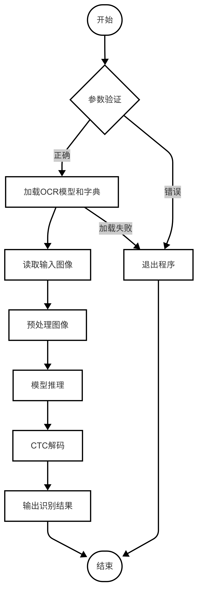
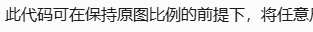
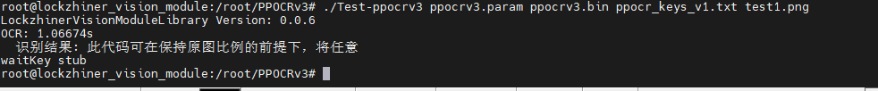

# PPOCRv3 字符识别
本章节在 Lockzhiner Vision Module 上基于PPOCRv3字符识别模型, 实现了一个简单的字符识别系统。

## 1. 基本知识讲解
### 1.1 字符识别简介
OCR（光学字符识别）是指通过电子设备读取并转换纸质文档或图像中的文字为可编辑和处理的数字文本的技术。它涉及图像预处理、字符分割、特征提取、字符识别及后处理等步骤，以实现高准确度的文字转换。OCR技术极大提升了信息数字化的效率，广泛应用于数字化图书馆、自动化数据录入、车牌识别系统及辅助阅读工具等领域，是现代办公与生活中不可或缺的一部分。
### 1.2 字符识别常用方法
- 模板匹配：通过与预定义字符模板比较来识别字符，适用于固定字体和字号。
- 特征提取：从字符中提取关键特征（如线条、端点）并使用分类器识别，适应字体变化。
- 神经网络：利用卷积神经网络自动学习字符特征，特别适合复杂背景和多变字体，提供高准确率。
这些方法各有优势，选择取决于具体应用需求和文档特性。随着技术发展，基于神经网络的方法因其高性能而得到广泛应用。

## 2. C++ API 文档
### 2.1 Net类
#### 2.1.1 头文件
```cpp
#include <ncnn/net.h>
```
- 作用：用于声明Net类，使得Net类可以在当前文件中使用。

#### 2.1.2 构造类对象
```cpp
ncnn::Net ocr_net;
```
- 作用：创建一个Net类型的对象实例，用于实现字符识别。
- 参数说明：
    - 无
- 返回值：
    - 无

#### 2.1.3 load_param函数
```cpp
int load_param(const DataReader& dr);
```
- 参数说明：
    - dr：传入的参数文件路径。
- 返回值：
    - 返回值为0表示加载参数文件成功。

#### 2.1.4 load_model函数
```cpp
int load_model(const DataReader& dr);
```
- 参数说明：
    - dr：传入的模型文件路径。
- 返回值：返回值为0表示加载模型成功。

#### 2.1.5 from_pixels函数
```cpp
ncnn::Mat::from_pixels(srcResize.data, ncnn::Mat::PIXEL_BGR, srcResize.cols, srcResize.rows);
```
- 参数说明：
    - srcResize.data：输入图像的像素数据指针。
    - ncnn::Mat::PIXEL_BGR：输入像素数据的颜色格式。
    - srcResize.cols：输入图像的宽度。
    - srcResize.rows：输入图像的高度。
- 返回值：适配成 NCNN 所需的格式的包含图像数据的新对象。

### 2.2 Extractor类
#### 2.2.1 头文件
```cpp
#include <ncnn/net.h>
```
- 作用：用于声明Extractor类，使得Extractor类可以在当前文件中使用。

#### 2.2.2 构造类函数
```cpp
ncnn::Extractor extractor = net.create_extractor();
```
- 作用：从已经加载了神经网络模型的 net 中创建一个 Extractor 实例，用于执行文字识别的推理任务。
- 参数说明：
    - 无
- 返回值：
    - 无

## 3. PPOCRv3 字符识别代码解析
### 3.1 流程图



### 3.2 核心代码解析
#### 3.2.1 初始化模型
```cpp
bool InitOCRModel(const string& param_path, const string& model_path, const string& dict_path)
```
- 作用：加载OCR模型参数和权重文件，初始化字符字典，完成OCR系统初始化。
- 参数说明：
    - param_path：模型结构文件路径(.param文件)。
    - model_path：模型权重文件路径(.bin文件)。
    - dict_path：字符字典文件路径。
- 返回值：
    - true：模型和字典加载均成功。
    - false：模型加载失败 或 字典加载失败。

#### 3.2.2 字符识别
```cpp
string RecognizePlate(cv::Mat plate_img)
```
- 作用：执行图像预处理、模型推理、CTC解码全流程。
- 参数说明：
    - plate_img：待识别的区域图像(BGR格式)。
- 返回值：
    - license：解码后的识别结果(UTF-8字符串)。

#### 3.2.3 CTC解码
```cpp
string decode_ctc(const ncnn::Mat& out)
```
- 作用：对OCR模型输出的概率矩阵进行CTC解码，将时序分类结果转换为可读文本序列。
- 参数说明：
    - out：模型输出的概率矩阵。
- 返回值：
    - result：解码后的文本字符串(已过滤无效字符)。

#### 3.2.4 加载字符字典
```cpp
vector<string> load_character_dict(const string& path, bool use_space_char)
```
- 作用：从文本文件加载字符字典，生成符合CTC模型要求的字符列表。
- 参数说明：
    - path：字典文件路径(每行一个字符)。
    - use_space_char：是否在字典末尾添加空格符。
- 返回值：
    - 结构化的字符列表，格式为：["blank", char1, char2,..., (空格)]。

### 3.3 完整代码实现
```cpp
#include <ncnn/net.h>
#include <lockzhiner_vision_module/edit/edit.h>
#include <chrono>
#include <iostream>
#include <vector>
#include <opencv2/opencv.hpp>
#include <fstream>
#include <algorithm>

using namespace std;
using namespace std::chrono;

// OCR配置参数
const cv::Size OCR_INPUT_SIZE(320, 48);

const bool USE_SPACE_CHAR = true;
const float MEAN_VALS[3] = {127.5f, 127.5f, 127.5f};
const float NORM_VALS[3] = {1.0f/127.5f, 1.0f/127.5f, 1.0f/127.5f};

ncnn::Net ocr_net;


vector<string> char_list;  // 从字典加载的字符列表

// 加载字符字典
vector<string> load_character_dict(const string& path, bool use_space_char) {
    vector<string> temp_list;
    ifstream file(path);
    if (!file.is_open()) {
        cerr << "Failed to open dictionary file: " << path << endl;
        return {};
    }
    
    string line;    
    while (getline(file, line)) {
        line.erase(remove(line.begin(), line.end(), '\r'), line.end());
        line.erase(remove(line.begin(), line.end(), '\n'), line.end());
        temp_list.push_back(line);
    }
    
    if (use_space_char) {
        temp_list.push_back(" ");
    }
    
    vector<string> char_list{"blank"};
    char_list.insert(char_list.end(), temp_list.begin(), temp_list.end());
    return char_list;
}

// CTC解码
string decode_ctc(const ncnn::Mat& out) {
    vector<int> indices;
    const int num_timesteps = out.h;
    const int num_classes = out.w;

    for (int t = 0; t < num_timesteps; ++t) {
        const float* prob = out.row(t);
        int max_idx = 0;
        float max_prob = prob[0];
        
        for (int c = 0; c < num_classes; ++c) {
            if (prob[c] > max_prob) {
                max_idx = c;
                max_prob = prob[c];
            }
        }
        indices.push_back(max_idx);
    }

    string result;
    int prev_idx = -1;
    
    for (int idx : indices) {
        if (idx == 0) {
            prev_idx = -1;
            continue;
        }
        if (idx != prev_idx) {
            if (idx < char_list.size()) {
                result += char_list[idx];
            }
            prev_idx = idx;
        }
    }
    
    return result;
}


// 初始化OCR模型
bool InitOCRModel(const string& param_path, const string& model_path, const string& dict_path) {
    if (!ocr_net.load_param(param_path.c_str()) && !ocr_net.load_model(model_path.c_str())) {
        char_list = load_character_dict(dict_path, USE_SPACE_CHAR);
        return !char_list.empty();
    }
    return false;
}

// 文字识别
string RecognizePlate(cv::Mat plate_img) {
    // 图像预处理
    cv::resize(plate_img, plate_img, OCR_INPUT_SIZE);
    ncnn::Mat in = ncnn::Mat::from_pixels(plate_img.data, 
                                        ncnn::Mat::PIXEL_BGR,
                                        plate_img.cols, 
                                        plate_img.rows);
    // PP-OCR风格归一化
    in.substract_mean_normalize(MEAN_VALS, NORM_VALS);

    // 模型推理
    ncnn::Extractor ex = ocr_net.create_extractor();
    ex.input("in0", in);
    
    ncnn::Mat out;
    ex.extract("out0", out);
    
    // CTC解码
    string license = decode_ctc(out);
    return license;
}

int main(int argc, char** argv) {
    // 参数验证
    if (argc != 5) {
        cerr << "Usage: " << argv[0] 
             << " <ocr_param> <ocr_model> <dict_path> [image_path]\n"
             << "Example:\n"
             << "  Realtime: " << argv[0] << " ocr.param ocr.bin ppocr_keys_v1.txt\n"
             << "  Image:    " << argv[0] << " ocr.param ocr.bin ppocr_keys_v1.txt test.jpg\n";
        return 1;
    }
    // 初始化OCR模型和字典
    if (!InitOCRModel(argv[1], argv[2], argv[3])) {
        cerr << "Failed to initialize OCR system" << endl;
        return 1;
    }

    // 图片处理模式
    cv::Mat image = cv::imread(argv[4]);
    if (image.empty()) {
        cerr << "Failed to read image: " << argv[4] << endl;
        return 1;
    }

    auto ocr_start = std::chrono::high_resolution_clock::now();
    string result = RecognizePlate(image);
    auto ocr_end = std::chrono::high_resolution_clock::now();
    std::cout << "OCR: " << std::chrono::duration<double>(ocr_end - ocr_start).count() << "s\n";

    cout << "  识别结果: " << result << endl;
    cv::waitKey(0);
}
```

## 4. 编译调试
### 4.1 编译环境搭建
- 请确保你已经按照 [开发环境搭建指南](../../../../docs/introductory_tutorial/cpp_development_environment.md) 正确配置了开发环境。
- 同时已经正确连接开发板。
### 4.2 Cmake介绍
```cmake
cmake_minimum_required(VERSION 3.10)

project(PPOCRv3)

set(CMAKE_CXX_STANDARD 17)
set(CMAKE_CXX_STANDARD_REQUIRED ON)

# 定义项目根目录路径
set(PROJECT_ROOT_PATH "${CMAKE_CURRENT_SOURCE_DIR}/../..")
message("PROJECT_ROOT_PATH = " ${PROJECT_ROOT_PATH})

include("${PROJECT_ROOT_PATH}/toolchains/arm-rockchip830-linux-uclibcgnueabihf.toolchain.cmake")

# 定义 OpenCV SDK 路径
set(OpenCV_ROOT_PATH "${PROJECT_ROOT_PATH}/third_party/opencv-mobile-4.10.0-lockzhiner-vision-module")
set(OpenCV_DIR "${OpenCV_ROOT_PATH}/lib/cmake/opencv4")
find_package(OpenCV REQUIRED)
set(OPENCV_LIBRARIES "${OpenCV_LIBS}")

# 定义 LockzhinerVisionModule SDK 路径
set(LockzhinerVisionModule_ROOT_PATH "${PROJECT_ROOT_PATH}/third_party/lockzhiner_vision_module_sdk")
set(LockzhinerVisionModule_DIR "${LockzhinerVisionModule_ROOT_PATH}/lib/cmake/lockzhiner_vision_module")
find_package(LockzhinerVisionModule REQUIRED)

# ncnn配置
set(NCNN_ROOT_DIR "${PROJECT_ROOT_PATH}/third_party/ncnn-20240820-lockzhiner-vision-module")  # 确保third_party层级存在
message(STATUS "Checking ncnn headers in: ${NCNN_ROOT_DIR}/include/ncnn")

# 验证头文件存在
if(NOT EXISTS "${NCNN_ROOT_DIR}/include/ncnn/net.h")
    message(FATAL_ERROR "ncnn headers not found. Confirm the directory contains ncnn: ${NCNN_ROOT_DIR}")
endif()

set(NCNN_INCLUDE_DIRS "${NCNN_ROOT_DIR}/include")
set(NCNN_LIBRARIES "${NCNN_ROOT_DIR}/lib/libncnn.a")

add_executable(Test-ppocrv3 ppocrv3.cc)
target_include_directories(Test-ppocrv3 PRIVATE ${LOCKZHINER_VISION_MODULE_INCLUDE_DIRS}  ${NCNN_INCLUDE_DIRS})
target_link_libraries(Test-ppocrv3 PRIVATE ${OPENCV_LIBRARIES} ${NCNN_LIBRARIES} ${LOCKZHINER_VISION_MODULE_LIBRARIES})

install(
    TARGETS Test-ppocrv3
    RUNTIME DESTINATION .  
)
```
### 4.3 编译项目
使用 Docker Destop 打开 LockzhinerVisionModule 容器并执行以下命令来编译项目
```bash
# 进入Demo所在目录
cd /LockzhinerVisionModuleWorkSpace/LockzhinerVisionModule/Cpp_example/D10_PPOCRv3
# 创建编译目录
rm -rf build && mkdir build && cd build
# 配置交叉编译工具链
export TOOLCHAIN_ROOT_PATH="/LockzhinerVisionModuleWorkSpace/arm-rockchip830-linux-uclibcgnueabihf"
# 使用cmake配置项目
cmake ..
# 执行编译项目
make -j8 && make install
```

在执行完上述命令后，会在build目录下生成可执行文件。


## 5. 执行结果
### 5.1 运行前准备
- 请确保你已经下载了 [凌智视觉模块字符识别模型结构文件](https://gitee.com/LockzhinerAI/LockzhinerVisionModule/releases/download/v0.0.6/ppocrv3.param)
- 请确保你已经下载了 [凌智视觉模块字符识别模型权重文件](https://gitee.com/LockzhinerAI/LockzhinerVisionModule/releases/download/v0.0.6/ppocrv3.bin)
- 请确保你已经下载了 [凌智视觉模块文字识别keys文件](https://gitee.com/LockzhinerAI/LockzhinerVisionModule/releases/download/v0.0.6/ppocr_keys_v1.txt)
### 5.2 运行过程
```shell
chmod 777 Test-ppocrv3
./Test-ppocrv3 ppocrv3.param ppocrv3.bin ppocr_keys_v1.txt image_path
```
### 5.3 运行效果
#### 5.3.1 PPOCRv3字符识别
- 测试图像



- 识别结果



#### 5.3.2 注意事项
由于本章节只训练了一个PPOCRv3的文字识别模型，并没有训练检测模型，所有只针对包含单行文本的图像效果比较好，对于包含多行文本的识别，效果并不是很好。

## 6. 总结
通过上述内容，我们成功实现了一个简单的基于PPOCRv3的字符识别系统，包括：

- 加载识别模型和检测图像。
- 进行图像的推理以及字符识别。
- 将识别结果打印出来。