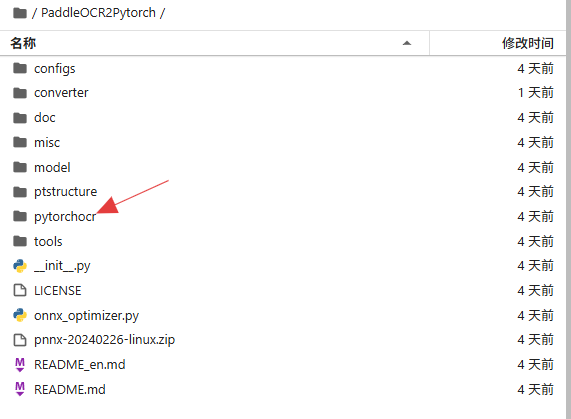
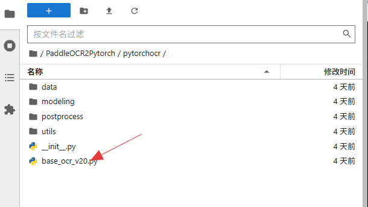
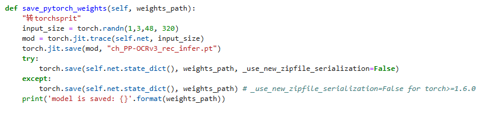
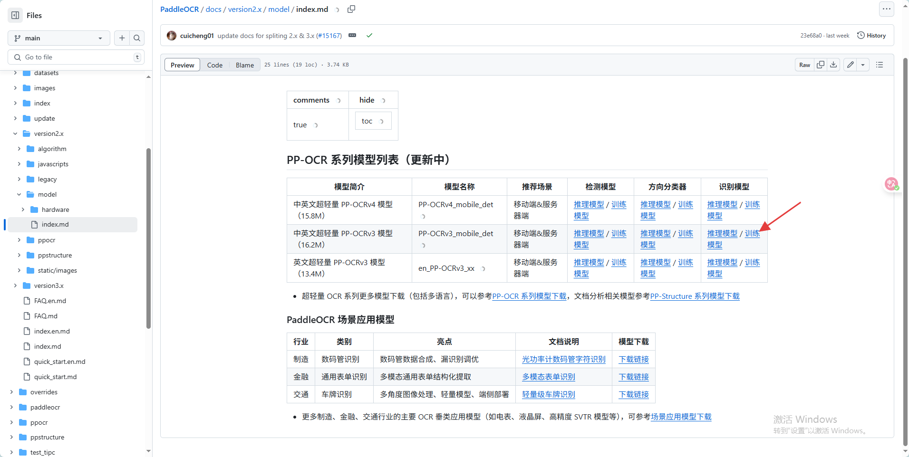
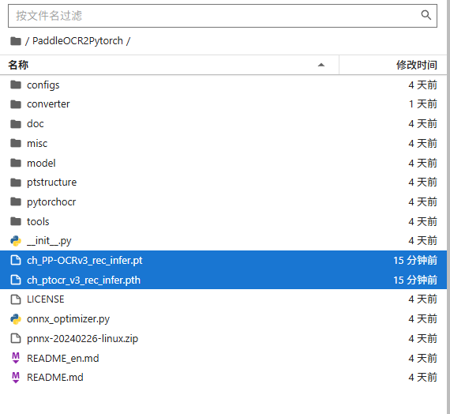
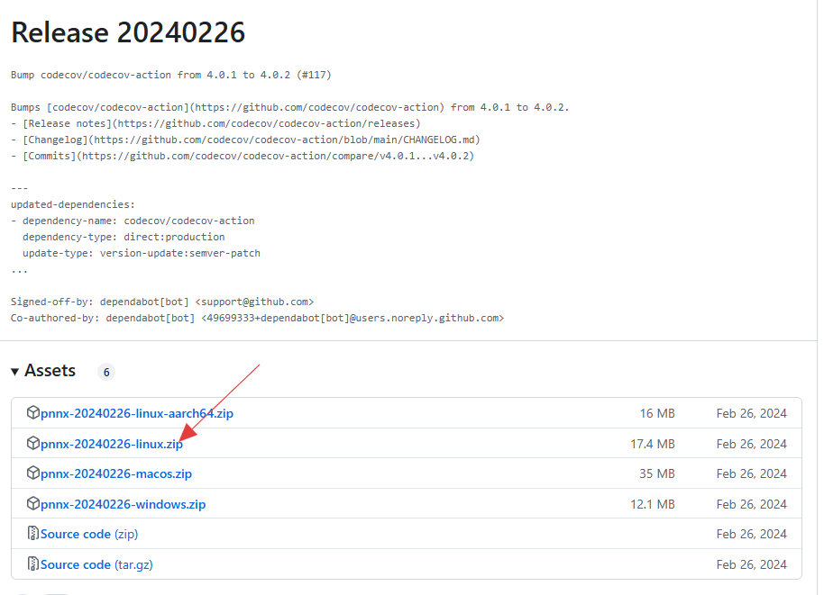
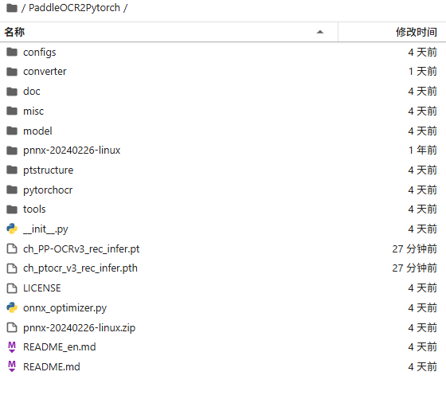
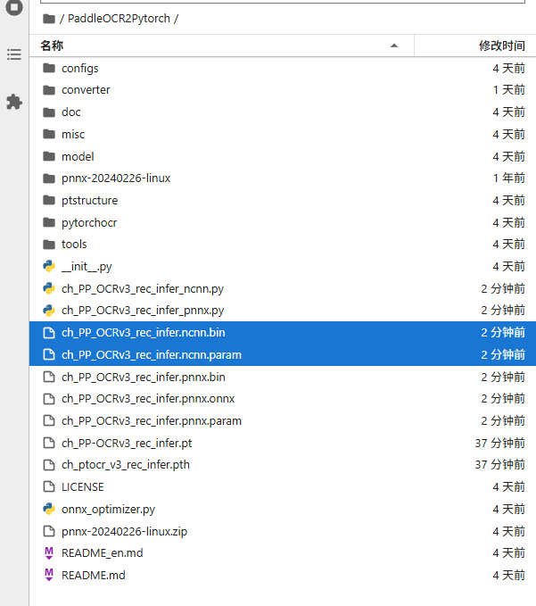

# PPOCRv3文字识别模型转NCNN部署
## 1. 简介
本文档详细介绍了如何将PPOCRv3文字识别模型转换为ncnn格式的完整实现流程，通过多框架协同实现跨平台部署，核心链路为：​paddle -> pth -> pt -> pnnx -> ncnn​​。之前也尝试使用paddle → onnx → ncnn的方案，但是在转ncnn过程中，遇到了某些层不支持的问题，经过修改ncnn模型参数，可实现部署，但是修改较复杂，很不易用，不推荐先转onnx再转到ncnn格式。现在利用paddle -> pth -> pt -> pnnx -> ncnn 的方式实现ncnn模型部署，且不需要对PPOCRv3的模型进行修改，以下是主要的实现步骤：

* paddle -> pth -> pt
* pt -> pnnx -> ncnn

## 2. paddle -> pth -> pt
执行以下指令克隆PaddleOCR2Pytorch项目
```shell
git clone https://gitcode.com/gh_mirrors/pa/PaddleOCR2Pytorch.git
```

之后执行以下指令进入PaddleOCR2Pytorch目录
```shell
cd PaddleOCR2Pytorch
```
进入目录以后，可以看到目录结构如下：



找到"./pytorchocr/base_ocr_v20.py"文件，对其中save_pytorch_weights函数修改




找到save_pytorch_weights函数，在save_pytorch_weights函数中添加如下代码：
```python
"转torchsprit"
input_size = torch.randn(1,3,48, 320)
mod = torch.jit.trace(self.net, input_size)
torch.jit.save(mod, "ch_PP-OCRv3_rec_infer.pt")
```
修改以后的save_pytorch_weights函数如下：


在终端运行以下命令，将PPOCRv3的文字识别模型由paddle格式转为pytorch格式:
```shell
python converter/ch_ppocr_v3_rec_converter.py --src_model_path "./model/ch_PP-OCRv3_rec_train/best_accuracy"
```
这里需要注意的是默认加载的是训练模型best_accuracy，大家可以去PaddleOCR官网下载  [PPOCRv3文字识别模型的训练模型](https://github.com/PaddlePaddle/PaddleOCR/blob/main/docs/version2.x/model/index.md)


运行完以上命令后，会在PaddleOCR2Pytorch目录中生成一个.pth模型和一个.pt模型。



## 3. pt -> pnnx -> ncnn
将.pt格式转换为ncnn格式需要用到第三方库pnnx，大家可以先去[pnnx官网](https://github.com/pnnx/pnnx/releases)下载安装包，我这边下载的版本是20240226的，大家可以根据自己的需求下载。



将下载后的安装包放到PaddleOCR2Pytorch目录下，然后解压。解压以后会在PaddleOCR2Pytorch目录下生成一个pnnx-20240226-linux文件夹，里面包含一个pnnx可执行文件。



之后在终端执行以下命令来生成ncnn模型文件(这里应用了2个inputshape是为了实现动态输入，H维上的值是任意设置的)。
```shell
./pnnx-20240226-linux/pnnx ch_PP-OCRv3_rec_infer.pt inputshape=[1,3,48,320] inputshape2=[1,3,48,480]
```
运行结束以后会在PaddleOCR2ncnn目录下生成ncnn格式的文件。



到这里我们就实现了将PPOCRv3文字识别模型转ncnn的全部流程，并且对转换以后的模型不需要做任何修改就可以进行推理。

## 4. NCNN部署推理
将以上生成的ncnn下载到本地，具体的ncnn部署demo可以查看 [PPOCRv3识别模型部署](./Cpp_example/D11_PPOCRv3/README.md)
