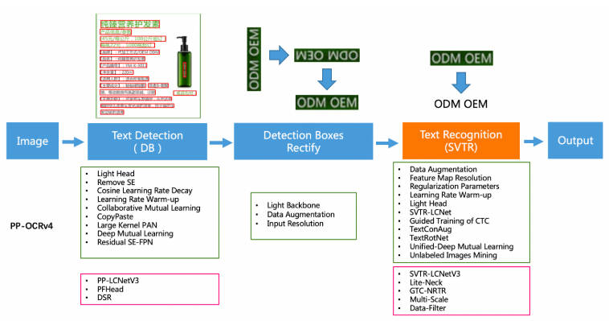
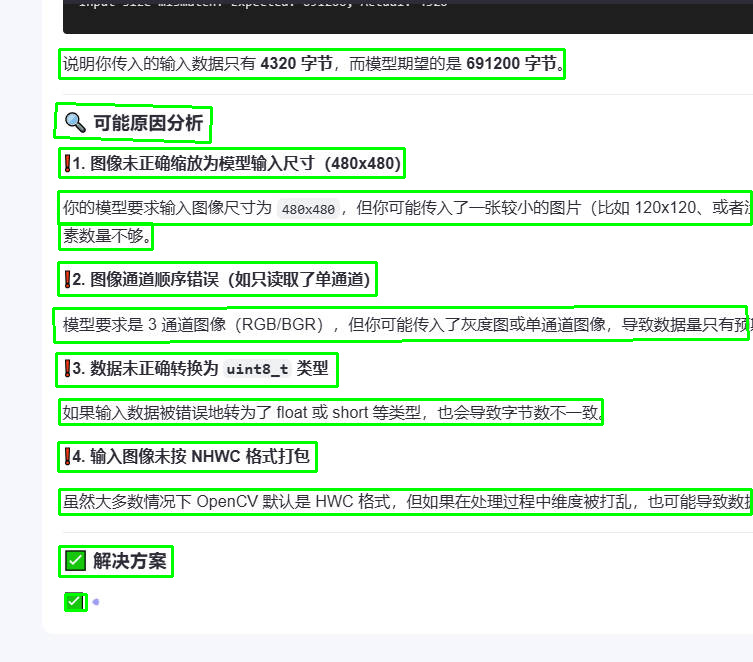
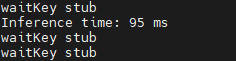

# PP-OCRv4 文本框检测
## 1. 模型介绍


PP-OCRv4在PP-OCRv3的基础上进一步升级。整体的框架图保持了与PP-OCRv3相同的pipeline，针对检测模型和识别模型进行了数据、网络结构、训练策略等多个模块的优化。


从算法改进思路上看，分别针对检测和识别模型，进行以下方面的改进：
检测模块：
- LCNetV3：精度更高的骨干网络
- PFHead：并行head分支融合结构
- DSR: 训练中动态增加shrink ratio
- CML：添加Student和Teacher网络输出的KL div loss
 

原理可前往PPOCR技术报告查看：https://paddlepaddle.github.io/PaddleOCR/v2.9/ppocr/blog/PP-OCRv4_introduction.html#1pfheadhead

## 2. 模型转换

参考[RKNN Model ZOO](https://github.com/airockchip/rknn_model_zoo/tree/main/examples/PPOCR/PPOCR-Det)将 PPOCRv4 的文本检测模型转化成 RKNN 模型。

```python

import sys
from rknn.api import RKNN

DATASET_PATH = '../../../../datasets/PPOCR/imgs/dataset_20.txt'
DEFAULT_RKNN_PATH = '../model/ppocrv4_det.rknn'
DEFAULT_QUANT = True

def parse_arg():
    if len(sys.argv) < 3:
        print("Usage: python3 {} onnx_model_path [platform] [dtype(optional)] [output_rknn_path(optional)]".format(sys.argv[0]));
        print("       platform choose from [rk3562, rk3566, rk3568, rk3576, rk3588, rv1126b, rv1109, rv1126, rk1808]")
        print("       dtype choose from    [i8, fp] for [rk3562, rk3566, rk3568, rk3576, rk3588, rv1126b]")
        print("       dtype choose from    [u8, fp] for [rv1109, rv1126, rk1808]")
        exit(1)

    model_path = sys.argv[1]
    platform = sys.argv[2]

    do_quant = DEFAULT_QUANT
    if len(sys.argv) > 3:
        model_type = sys.argv[3]
        if model_type not in ['i8', 'u8', 'fp']:
            print("ERROR: Invalid model type: {}".format(model_type))
            exit(1)
        elif model_type in ['i8', 'u8']:
            do_quant = True
        else:
            do_quant = False

    if len(sys.argv) > 4:
        output_path = sys.argv[4]
    else:
        output_path = DEFAULT_RKNN_PATH

    return model_path, platform, do_quant, output_path

if __name__ == '__main__':
    model_path, platform, do_quant, output_path = parse_arg()

    # Create RKNN object
    rknn = RKNN(verbose=False)

    # Pre-process config
    print('--> Config model')
    rknn.config(mean_values=[[123.675, 116.28, 103.53]], std_values=[[58.395, 57.12, 57.375]], target_platform=platform)
    print('done')

    # Load model
    print('--> Loading model')
    ret = rknn.load_onnx(model=model_path)
    if ret != 0:
        print('Load model failed!')
        exit(ret)
    print('done')

    # Build model
    print('--> Building model')
    ret = rknn.build(do_quantization=do_quant, dataset=DATASET_PATH)
    if ret != 0:
        print('Build model failed!')
        exit(ret)
    print('done')

    # Export rknn model
    print('--> Export rknn model')
    ret = rknn.export_rknn(output_path)
    if ret != 0:
        print('Export rknn model failed!')
        exit(ret)
    print('done')

    # Release
    rknn.release()
```
根据目标平台，完成参数配置，运行程序完成转换。在完成模型转换后可以查看 rv1106 的算子支持手册，确保所有的算子是可以使用的，避免白忙活。

## 3. 模型部署
```cpp
#include <iostream>
#include <cmath>
#include <opencv2/opencv.hpp>
#include "rknpu2_backend/rknpu2_backend.h"
#include <cstdlib>
#include <ctime>
#include <stdio.h>
#include <stdlib.h>
#include <string.h>
#include <math.h>
#include "postprocess.h"
#include <lockzhiner_vision_module/edit/edit.h>
#include <lockzhiner_vision_module/vision/utils/visualize.h>

// 用于计时的头文件
#include <chrono>

using namespace std::chrono;

int main(int argc, char *argv[])
{
    if (argc != 2)
    {
        std::cerr << "Usage: " << argv[0] << " <model_path>" << std::endl;
        return 1;
    }

    const std::string model_path = argv[1];

    // 初始化RKNN后端
    lockzhiner_vision_module::vision::RKNPU2Backend backend;
    if (!backend.Initialize(model_path))
    {
        std::cerr << "Failed to initialize RKNN backend" << std::endl;
        return -1;
    }

    lockzhiner_vision_module::edit::Edit edit;

    if (!edit.StartAndAcceptConnection())
    {
        std::cerr << "Error: Failed to start and accept connection." << std::endl;
        return EXIT_FAILURE;
    }
    std::cout << "Device connected successfully." << std::endl;

    // 打开摄像头
    cv::VideoCapture cap;
    cap.set(cv::CAP_PROP_FRAME_WIDTH, 640);
    cap.set(cv::CAP_PROP_FRAME_HEIGHT, 480);
    cap.open(0);
    if (!cap.isOpened())
    {
        std::cerr << "Error: Could not open camera." << std::endl;
        return 1;
    }

    cv::Mat image;
    int frame_count = 0; // 帧计数器

    while (true)
    {
        cap >> image;
        if (image.empty())
            continue;

        frame_count++;

        // 每隔3帧处理一次（即每4帧处理1次）
        if (frame_count % 4 == 1)
        {
            // 获取输入Tensor的信息
            auto input_tensor = backend.GetInputTensor(0);
            std::vector<size_t> input_dims = input_tensor.GetDims();
            float input_scale = input_tensor.GetScale();
            int input_zp = input_tensor.GetZp();

            // 预处理
            cv::Mat preprocessed = preprocess(image, input_dims, input_scale, input_zp);
            if (preprocessed.empty())
            {
                std::cerr << "Preprocessing failed" << std::endl;
                goto skip_inference;
            }

            // 验证输入数据尺寸
            size_t expected_input_size = input_tensor.GetElemsBytes();
            size_t actual_input_size = preprocessed.total() * preprocessed.elemSize();
            if (expected_input_size != actual_input_size)
            {
                std::cerr << "Input size mismatch! Expected: " << expected_input_size
                          << ", Actual: " << actual_input_size << std::endl;
                goto skip_inference;
            }

            // 拷贝输入数据
            void *input_data = input_tensor.GetData();
            memcpy(input_data, preprocessed.data, actual_input_size);

            // 开始计时
            auto start = high_resolution_clock::now();

            // 推理
            if (!backend.Run())
            {
                std::cerr << "Inference failed!" << std::endl;
                free(input_data);
                goto skip_inference;
            }

            // 结束计时
            auto end = high_resolution_clock::now();
            auto duration_ms = duration_cast<milliseconds>(end - start).count();
            std::cout << "Inference time: " << duration_ms << " ms" << std::endl;

            // 获取输出结果
            const auto &output_tensor = backend.GetOutputTensor(0);
            std::vector<size_t> output_dims = output_tensor.GetDims();
            float output_zp = output_tensor.GetZp();
            float output_scale = output_tensor.GetScale();
            const int8_t *output_data_int8 = static_cast<const int8_t *>(output_tensor.GetData());

            // 转换为浮点型
            std::vector<float> output_data_float(output_tensor.GetNumElems());
            for (size_t i = 0; i < output_tensor.GetNumElems(); ++i)
            {
                output_data_float[i] = (output_data_int8[i] - output_zp) * output_scale;
            }

            // 获取原始图像宽高
            int original_width = image.cols;
            int original_height = image.rows;
            float scale_w = (float)original_width / 480;
            float scale_h = (float)original_height / 480;

            // 后处理
            ppocr_det_result results = {0};
            dbnet_postprocess(output_data_float.data(),
                              output_dims[2], output_dims[3],
                              0.5, 0.3, true, "slow", 2.0, "quad",
                              scale_w, scale_h, &results);

            // 绘制检测框
            draw_boxes(&image, results);
        }

    skip_inference:
        // 显示当前帧（无论是否进行了推理）
        edit.Print(image);

        // 按下 ESC 键退出
        if (cv::waitKey(1) == 27)
        {
            break;
        }
    }

    cap.release();
    return 0;
}
```

## 4. 编译程序

使用 Docker Destop 打开 LockzhinerVisionModule 容器并执行以下命令来编译项目
```bash
# 进入Demo所在目录
cd /LockzhinerVisionModuleWorkSpace/LockzhinerVisionModule/Cpp_example/D12_PPOCRv4-Det
# 创建编译目录
rm -rf build && mkdir build && cd build
# 配置交叉编译工具链
export TOOLCHAIN_ROOT_PATH="/LockzhinerVisionModuleWorkSpace/arm-rockchip830-linux-uclibcgnueabihf"
# 使用cmake配置项目
cmake ..
# 执行编译项目
make -j8 
```

在执行完上述命令后，会在build目录下生成可执行文件。


## 5. 执行结果
### 5.1 运行前准备

- 请确保你已经下载了 [凌智视觉模块字符检测模型权重文件](https://gitee.com/LockzhinerAI/LockzhinerVisionModule/releases/download/v0.0.6/ppocrv4_det.rknn)

### 5.2 运行过程
```shell
chmod 777 Test-ppocrv4
./Test-ppocrv4 ppocrv4_det.rknn 
```
### 5.3 运行效果
#### 5.3.1 ppocrv4字符识别
- 测试结果



- 测试时间



瓶颈分析，虽然 ppocrv4 的文本检测模型的推理时间为 90ms 左右，但是在实际使用时建议使用跳帧检测，不每一帧都进行推理，可以有效降低卡顿。


#### 5.3.2 注意事项
由于本章节只部署了一个 PPOCRv4 的文字检测模型，并没有训练检测模型，如需训练自己的数据集，可使用 paddleOCR 训练检测模型。
