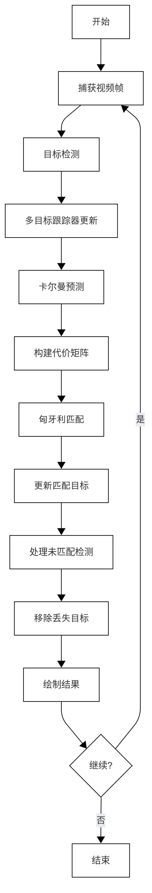
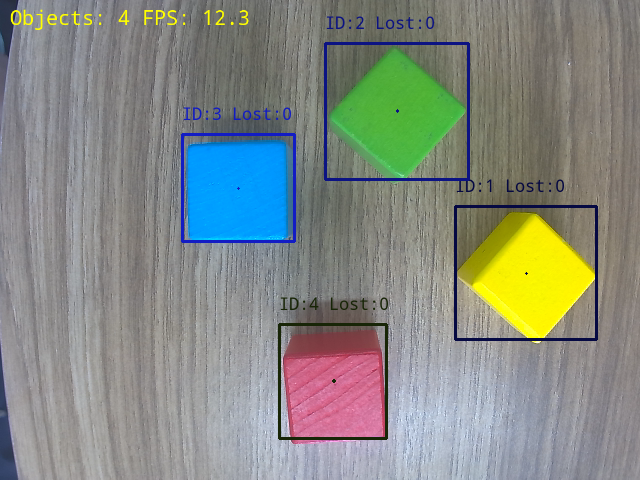

# 多目标跟踪

本文档介绍了如何使用 lockzhiner_vision_module 库结合卡尔曼滤波和匈牙利算法实现多目标跟踪系统。

## 1. 基础知识讲解

### 1.1 多目标跟踪的基本概念

多目标跟踪（MOT）是计算机视觉中处理视频序列中移动目标检测、跟踪和识别的任务。它的核心挑战包括：

- 数据关联：将当前帧的检测结果与现有轨迹匹配
- 轨迹管理：处理新目标的出现、旧目标的消失
- 遮挡处理：处理目标被遮挡或暂时离开画面的情况

### 1.2 卡尔曼滤波

卡尔曼滤波是一种高效的递归算法，用于在动态系统中估计目标的状态：

- ​​预测阶段​​：基于运动模型估计目标在下一帧的位置

- ​更新阶段​​：使用新的观测值更新状态估计

- 在多目标跟踪中，卡尔曼滤波用于预测目标位置、速度和其他状态变量

### 1.3 匈牙利算法

匈牙利算法是解决二分图最大匹配问题的经典算法，再MOT中的作用：

- 将检测到的目标与现有的跟踪轨迹关联
- 解决分配问题，找到最优的检测轨迹匹配

## 2. API 文档

### 2.1 EnhancedKalmanFilter 类

#### 2.1.1 构造函数

```cpp
EnhancedKalmanFilter(float Ts = 0.033f);
```

- 作用：创建6D卡尔曼滤波器对象
- 参数：
  - Ts：时间步长（默认0.033秒）
- 初始化状态：
  - 状态向量：[x, y, w, h, dx, dy] （位置+尺寸+速度）
  - 初始化过程噪声、观测噪声矩阵

#### 2.1.2 主要成员函数

```cpp
void Update(const cv::Mat& Z);
```

- 作用：更新卡尔曼滤波器状态
- 参数：
  - z：观测向量[x,y,w,h]

```cpp
void Predict();
```

- 作用：预测下一时刻的状态

```cpp
cv::Rect GetRectFromState() const;
```

- 作用：获取目标边界框
- 返回值：当前状态的矩形区域

```cpp
cv::Point2d GetVelocity() const;
```

- 作用：获取目标速度向量
- 返回值：速度向量（dx，dy）

### 2.2 HungarianAlgorithm 类

#### 2.2.1 静态成员函数

```cpp
static std::vector<int> Solve(const std::vector<std::vector<double>>& costMatrix);
```

- 作用：解决检测- 轨迹匹配问题
- 参数：
  - costMatrix：代价矩阵（行：跟踪器，列：检测结果）
- 返回值：
  - 匹配索引向量（元素对应检测索引，-1表示未匹配）

### 2.3 MultiObjectTracker 类

#### 2.3.1 结构体：TrackedObject

```cpp
struct TrackedObject {
    int id;  // 目标ID
    cv::Rect rect;  // 目标边界框
    cv::Point2d velocity;  // 速度向量
    EnhancedKalmanFilter ekf;  // 关联的卡尔曼滤波器
    int lost_frames;  // 连续丢失帧数
    int max_lost_frames;  // 最大允许丢失帧数
    
    // 成员函数省略...
};
```

#### 2.3.2 成员函数

```cpp
void Update(const std::vector<cv::Rect>& detections, float delta_time);
```

- 作用：更新多目标跟踪器状态
- 参数：
  - detections：当前帧的检测结果
  - delta_time：距离上一帧的时间差

```cpp
const std::map<int, TrackedObject>& GetActiveObjects() const;
```

- 作用：获取所有活动目标
- 返回值：ID到目标对象的映射

### 2.4 辅助函数

```cpp
double CalculateIOU(const cv::Rect& rect1, const cv::Rect& rect2);
```

- 作用：计算两矩形交并比（IoU）

```cpp
double CalculateAppearanceSimilarity(const cv::Rect& rect1, const cv::Rect& rect2);
```

- 作用：计算基于目标尺寸的相似度（外观相似度）

## 3. 系统架构与核心逻辑

### 3.1 系统流程图


### 3.2 多目标跟踪工作流程

#### 3.2.1 目标检测

```cpp
auto results = model.Predict(input_mat);
std::vector<cv::Rect> detections;
for (const auto& res : results) {
    detections.push_back(res.box);
}
```

#### 3.2.2 跟踪器预测

```cpp
// 更新所有跟踪器的预测状态
for (auto& kv : tracked_objects) {
    kv.second.Predict(Ts);
}
```

#### 3.2.3 代价矩阵计算

- 综合三种指标：
  - IoU(重叠率)
  - 中心点距离
  - 尺寸相似度
- 权重分配：60% IoU + 30% 距离 + 10% 尺寸相似度

#### 3.2.4 数据关联（匈牙利算法）

```cpp
std::vector<int> assignments = HungarianAlgorithm::Solve(cost_matrix);
```

#### 3.2.5 跟踪器状态更新

- 匹配成功的更新卡尔曼滤波器
- 未匹配的检测创建新的跟踪器
- 未匹配的跟踪器增加丢失技术

#### 3.2.6 绘制结果

- 为每个目标分配唯一颜色
- 绘制边界框、ID和丢失帧数
- 绘制速度向量

### 3.3完整代码实现

```cpp
#include <lockzhiner_vision_module/edit/edit.h>
#include <lockzhiner_vision_module/vision/deep_learning/detection/paddle_det.h>
#include <lockzhiner_vision_module/vision/utils/visualize.h>

#include <algorithm>
#include <chrono>
#include <cmath>
#include <iostream>
#include <limits>
#include <map>
#include <memory>
#include <opencv2/opencv.hpp>
#include <vector>

using namespace std::chrono;

// ================== 增强版 6D 卡尔曼滤波类 ==================
class EnhancedKalmanFilter {
 public:
  EnhancedKalmanFilter(float Ts = 0.033f) : prediction_steps(1) {
    Initialize(Ts);
  }

  void Initialize(float Ts) {
    Ts_ = Ts;
    // 状态转移矩阵 A (6x6)
    A = cv::Mat::eye(6, 6, CV_64F);
    A.at<double>(0, 4) = Ts;
    A.at<double>(1, 5) = Ts;

    // 观测矩阵 C (4x6) - 只观测位置和大小
    C = cv::Mat::zeros(4, 6, CV_64F);
    C.at<double>(0, 0) = 1;
    C.at<double>(1, 1) = 1;
    C.at<double>(2, 2) = 1;
    C.at<double>(3, 3) = 1;

    // 增大过程噪声 - 使预测更灵活
    Q = cv::Mat::eye(6, 6, CV_64F);

    Q.at<double>(0, 0) = 1e-2;  // x位置噪声增加
    Q.at<double>(1, 1) = 1e-2;  // y位置噪声增加
    Q.at<double>(2, 2) = 1e-6;  // 宽度噪声不变
    Q.at<double>(3, 3) = 1e-6;  // 高度噪声不变
    Q.at<double>(4, 4) = 1e-3;  // x速度噪声减小
    Q.at<double>(5, 5) = 1e-3;  // y速度噪声减小

    // 调整观测噪声 - 使预测更具主导性
    R = cv::Mat::eye(4, 4, CV_64F);
    R.at<double>(0, 0) = 1e-2;  // x位置观测噪声减小
    R.at<double>(1, 1) = 1e-2;  // y位置观测噪声减小
    R.at<double>(2, 2) = 1e-1;  // 宽度观测噪声增加
    R.at<double>(3, 3) = 1e-1;  // 高度观测噪声增加

    // 初始估计误差协方差矩阵 P (增大初始不确定性)
    P = cv::Mat::eye(6, 6, CV_64F) * 100;

    // 初始状态 [x, y, w, h, dx, dy]
    x_hat = cv::Mat::zeros(6, 1, CV_64F);
    has_initialized = false;

    // 初始化临时Q矩阵
    Q_temp = Q.clone();
  }

  void UpdateTs(float Ts) {
    Ts_ = Ts;
    // 更新状态转移矩阵中的时间项
    A.at<double>(0, 4) = Ts;
    A.at<double>(1, 5) = Ts;
  }

  void Update(const cv::Mat& Z) {
    if (!has_initialized) {
      // 首次更新，直接初始化状态
      x_hat.at<double>(0) = Z.at<double>(0);
      x_hat.at<double>(1) = Z.at<double>(1);
      x_hat.at<double>(2) = Z.at<double>(2);
      x_hat.at<double>(3) = Z.at<double>(3);
      x_hat.at<double>(4) = 0;
      x_hat.at<double>(5) = 0;
      has_initialized = true;
      return;
    }

    // 检查位置偏差大小
    cv::Mat residual = Z - C * (A * x_hat);
    double positionError = cv::norm(residual.rowRange(0, 2));

    // 动态加速收敛机制
    if (positionError > 20.0) {
      // 位置偏差较大时临时增大位置过程噪声
      Q_temp = Q.clone();
      Q_temp.at<double>(0, 0) *= 10.0;
      Q_temp.at<double>(1, 1) *= 10.0;
    } else {
      Q_temp = Q.clone();
    }

    // 预测步骤
    cv::Mat x_hat_minus = A * x_hat;
    cv::Mat P_minus = A * P * A.t() + Q_temp;  // 使用临时Q

    // 计算残差
    cv::Mat y = Z - C * x_hat_minus;

    // 计算卡尔曼增益 K
    cv::Mat S = C * P_minus * C.t() + R;
    cv::Mat K = P_minus * C.t() * S.inv();

    // 更新状态
    x_hat = x_hat_minus + K * y;

    // 更新协方差
    cv::Mat I = cv::Mat::eye(6, 6, CV_64F);
    P = (I - K * C) * P_minus;
  }

  void Predict() {
    if (!has_initialized) return;
    x_hat = A * x_hat;
    P = A * P * A.t() + Q_temp;
  }

  cv::Mat GetState() const { return x_hat.clone(); }

  cv::Mat GetPredictedState(int steps = 1) const {
    if (!has_initialized) return cv::Mat();
    cv::Mat state = x_hat.clone();
    cv::Mat A_step = cv::Mat::eye(6, 6, CV_64F);
    A_step.at<double>(0, 4) = Ts_ * steps;
    A_step.at<double>(1, 5) = Ts_ * steps;
    return A_step * state;
  }

  void SetPredictionSteps(int steps) { prediction_steps = std::max(1, steps); }

  int GetPredictionSteps() const { return prediction_steps; }

  // 重置滤波器
  void Reset() {
    has_initialized = false;
    // 重置协方差矩阵
    P = cv::Mat::eye(6, 6, CV_64F) * 100;
  }

  bool HasInitialized() const { return has_initialized; }

  cv::Rect GetRectFromState() const {
    if (!has_initialized) return cv::Rect();
    cv::Mat state = GetState();
    return cv::Rect(static_cast<int>(state.at<double>(0)),
                    static_cast<int>(state.at<double>(1)),
                    static_cast<int>(state.at<double>(2)),
                    static_cast<int>(state.at<double>(3)));
  }

  // 获取速度向量
  cv::Point2d GetVelocity() const {
    if (!has_initialized) return cv::Point2d(0, 0);
    return cv::Point2d(x_hat.at<double>(4), x_hat.at<double>(5));
  }

 private:
  cv::Mat A, C, Q, R, P;
  cv::Mat x_hat;
  cv::Mat Q_temp;  // 动态调整的Q矩阵
  float Ts_;
  int prediction_steps;
  bool has_initialized;
};

// 计算两个矩形的IOU（交并比）
double CalculateIOU(const cv::Rect& rect1, const cv::Rect& rect2) {
  // 计算交集矩形
  int x1 = std::max(rect1.x, rect2.x);
  int y1 = std::max(rect1.y, rect2.y);
  int x2 = std::min(rect1.x + rect1.width, rect2.x + rect2.width);
  int y2 = std::min(rect1.y + rect1.height, rect2.y + rect2.height);

  int intersectionArea = std::max(0, x2 - x1) * std::max(0, y2 - y1);

  // 计算并集面积
  int area1 = rect1.width * rect1.height;
  int area2 = rect2.width * rect2.height;

  // 避免除以0
  if (area1 + area2 - intersectionArea <= 0) {
    return 0.0;
  }

  return static_cast<double>(intersectionArea) /
         (area1 + area2 - intersectionArea);
}

// 计算两个矩形中心点的欧式距离
double CalculateCenterDistance(const cv::Rect& rect1, const cv::Rect& rect2) {
  cv::Point center1(rect1.x + rect1.width / 2, rect1.y + rect1.height / 2);
  cv::Point center2(rect2.x + rect2.width / 2, rect2.y + rect2.height / 2);
  return cv::norm(center1 - center2);
}

// 计算外观相似性（使用矩形大小差异作为简单度量）
double CalculateAppearanceSimilarity(const cv::Rect& rect1,
                                     const cv::Rect& rect2) {
  double sizeDiff =
      std::abs(rect1.width * rect1.height - rect2.width * rect2.height);
  // 归一化：10000是一个经验值，代表典型的最大矩形面积
  return std::exp(-sizeDiff / 10000.0);
}

// ================== 匈牙利算法实现 ==================
class HungarianAlgorithm {
 public:
  // 解指派问题（最小化代价）
  static std::vector<int> Solve(
      const std::vector<std::vector<double>>& costMatrix) {
    int n = costMatrix.size();
    if (n == 0) return {};

    int m = costMatrix[0].size();
    if (m == 0) return std::vector<int>(n, -1);

    // 预处理: 确保矩阵是方阵
    std::vector<std::vector<double>> cost = costMatrix;
    if (n > m) {
      for (auto& row : cost) {
        row.resize(n, std::numeric_limits<double>::max());
      }
      m = n;
    } else if (m > n) {
      cost.resize(m,
                  std::vector<double>(m, std::numeric_limits<double>::max()));
      for (int i = n; i < m; ++i) {
        for (int j = 0; j < m; ++j) {
          if (j < costMatrix[0].size()) {
            cost[i][j] = costMatrix[i % n][j];
          }
        }
      }
      n = m;
    }

    // 初始化变量
    std::vector<double> u(n + 1, 0);
    std::vector<double> v(m + 1, 0);
    std::vector<int> p(m + 1, 0);
    std::vector<int> way(m + 1, 0);

    for (int i = 1; i <= n; ++i) {
      p[0] = i;
      int j0 = 0;
      std::vector<double> minv(m + 1, std::numeric_limits<double>::max());
      std::vector<char> used(m + 1, false);

      do {
        used[j0] = true;
        int i0 = p[j0];
        double delta = std::numeric_limits<double>::max();
        int j1 = 0;

        for (int j = 1; j <= m; ++j) {
          if (!used[j]) {
            double cur = cost[i0 - 1][j - 1] - u[i0] - v[j];
            if (cur < minv[j]) {
              minv[j] = cur;
              way[j] = j0;
            }
            if (minv[j] < delta) {
              delta = minv[j];
              j1 = j;
            }
          }
        }

        for (int j = 0; j <= m; ++j) {
          if (used[j]) {
            u[p[j]] += delta;
            v[j] -= delta;
          } else {
            minv[j] -= delta;
          }
        }

        j0 = j1;
      } while (p[j0] != 0);

      do {
        int j1 = way[j0];
        p[j0] = p[j1];
        j0 = j1;
      } while (j0 != 0);
    }

    // 构建结果向量
    std::vector<int> result(n, -1);
    for (int j = 1; j <= m; ++j) {
      if (p[j] != 0 && p[j] <= static_cast<int>(result.size())) {
        result[p[j] - 1] = j - 1;
      }
    }

    return result;
  }
};

// 多目标跟踪器类
class MultiObjectTracker {
 public:
  struct TrackedObject {
    int id;
    cv::Rect rect;
    cv::Point2d velocity;
    EnhancedKalmanFilter ekf;
    int lost_frames;
    int max_lost_frames;

    // 添加默认构造函数
    TrackedObject()
        : id(-1),
          rect(0, 0, 0, 0),
          velocity(0, 0),
          lost_frames(0),
          max_lost_frames(30) {
      ekf.Initialize(0.033f);
    }

    TrackedObject(int obj_id, const cv::Rect& init_rect, float Ts)
        : id(obj_id),
          rect(init_rect),
          velocity(0, 0),
          lost_frames(0),
          max_lost_frames(30) {
      ekf.Initialize(Ts);
      // 初始化卡尔曼滤波器
      cv::Mat Z = (cv::Mat_<double>(4, 1) << init_rect.x, init_rect.y,
                   init_rect.width, init_rect.height);
      ekf.Update(Z);
    }

    void Update(const cv::Rect& new_rect, float Ts) {
      ekf.UpdateTs(Ts);
      cv::Mat Z = (cv::Mat_<double>(4, 1) << new_rect.x, new_rect.y,
                   new_rect.width, new_rect.height);
      ekf.Update(Z);
      rect = ekf.GetRectFromState();
      velocity = ekf.GetVelocity();
      lost_frames = 0;
    }

    void Predict(float Ts) {
      ekf.UpdateTs(Ts);
      ekf.Predict();
      rect = ekf.GetRectFromState();
      velocity = ekf.GetVelocity();
      lost_frames++;
    }

    // 当丢失帧数超过max_lost_frames时，视为丢失
    bool IsActive() const { return lost_frames <= max_lost_frames; }
  };

  MultiObjectTracker() : next_id(1), Ts(0.033f) {}

  void Update(const std::vector<cv::Rect>& detections, float delta_time) {
    Ts = delta_time;

    // 步骤1: 卡尔曼预测
    for (auto& kv : tracked_objects) {
      kv.second.Predict(Ts);
    }

    // 如果没有检测结果，直接返回
    if (detections.empty()) {
      return;
    }

    // 步骤2: 构建代价矩阵
    std::vector<std::vector<double>> cost_matrix;
    std::vector<int> active_tracker_indices;

    // 收集所有活跃的跟踪器
    for (auto& kv : tracked_objects) {
      if (kv.second.IsActive()) {
        active_tracker_indices.push_back(kv.first);
      }
    }

    // 构建代价矩阵
    for (int tracker_idx : active_tracker_indices) {
      TrackedObject& tracker = tracked_objects[tracker_idx];
      std::vector<double> costs;
      for (const auto& det : detections) {
        // 综合代价：IOU + 位置距离 + 外观相似性
        double iou = CalculateIOU(tracker.rect, det);
        // 避免NaN/Inf
        if (std::isnan(iou)) iou = 0.0;
        iou = std::max(0.0, std::min(iou, 1.0));

        double dist = CalculateCenterDistance(tracker.rect, det);
        double appearance = CalculateAppearanceSimilarity(tracker.rect, det);

        // 综合代价函数
        double cost =
            (1.0 - iou) * 0.6 + (dist / 100.0) * 0.3 + (1.0 - appearance) * 0.1;
        costs.push_back(cost);
      }
      cost_matrix.push_back(costs);
    }

    // 匹配结果存储
    std::vector<int> assignments;
    if (!cost_matrix.empty()) {
      assignments = HungarianAlgorithm::Solve(cost_matrix);
    } else {
      // 如果没有活跃跟踪器，分配所有检测为未匹配
      assignments = std::vector<int>(active_tracker_indices.size(), -1);
    }

    // 步骤3: 处理匹配结果
    // 创建一个布尔数组来标记每个检测是否被匹配
    std::vector<bool> detection_matched(detections.size(), false);
    for (int i = 0; i < assignments.size() && i < active_tracker_indices.size();
         ++i) {
      int det_index = assignments[i];
      if (det_index >= 0 && det_index < static_cast<int>(detections.size())) {
        int tracker_idx = active_tracker_indices[i];
        // 检查矩形是否有效
        const cv::Rect& new_rect = detections[det_index];
        if (new_rect.width > 0 && new_rect.height > 0) {
          tracked_objects[tracker_idx].Update(new_rect, Ts);
          detection_matched[det_index] = true;
        }
      }
    }

    // 步骤4: 为未匹配的检测创建新跟踪器
    for (int i = 0; i < detections.size(); ++i) {
      if (!detection_matched[i] && detections[i].width > 0 &&
          detections[i].height > 0) {
        // 创建新跟踪器
        tracked_objects.insert(
            std::make_pair(next_id, TrackedObject(next_id, detections[i], Ts)));
        next_id++;
      }
    }

    // 步骤5: 移除丢失时间过长的跟踪器
    for (auto it = tracked_objects.begin(); it != tracked_objects.end();) {
      // 如果丢失超过30帧，移除跟踪器
      if (!it->second.IsActive()) {
        it = tracked_objects.erase(it);
      } else {
        ++it;
      }
    }
  }

  // 获取所有活跃的目标
  const std::map<int, TrackedObject>& GetActiveObjects() const {
    return tracked_objects;
  }

 private:
  std::map<int, TrackedObject> tracked_objects;
  int next_id;
  float Ts;
};

int main(int argc, char* argv[]) {
  if (argc != 2) {
    std::cerr << "Usage: Test-PaddleDet model_path" << std::endl;
    return 1;
  }

  // 初始化模型
  lockzhiner_vision_module::vision::PaddleDet model;
  if (!model.Initialize(argv[1])) {
    std::cout << "Failed to initialize model." << std::endl;
    return 1;
  }

  lockzhiner_vision_module::edit::Edit edit;
  if (!edit.StartAndAcceptConnection()) {
    std::cerr << "Error: Failed to start and accept connection." << std::endl;
    return EXIT_FAILURE;
  }
  std::cout << "Device connected successfully." << std::endl;

  // 打开摄像头
  cv::VideoCapture cap;
  cap.set(cv::CAP_PROP_FRAME_WIDTH, 640);
  cap.set(cv::CAP_PROP_FRAME_HEIGHT, 480);

  if (!cap.open(0)) {
    std::cerr << "Couldn't open video capture device" << std::endl;
    return -1;
  }

  cv::Mat input_mat;

  // 创建多目标跟踪器
  MultiObjectTracker tracker;

  // 创建随机颜色生成器
  cv::RNG rng(0xFFFFFFFF);

  auto last_time = high_resolution_clock::now();

  while (true) {
    auto current_time = high_resolution_clock::now();
    float Ts =
        duration_cast<milliseconds>(current_time - last_time).count() / 1000.0f;
    if (Ts <= 0.001f) Ts = 0.033f;  // 避免零时间间隔
    last_time = current_time;

    cap >> input_mat;
    if (input_mat.empty()) {
      std::cerr << "Warning: Captured an empty frame." << std::endl;
      continue;
    }

    // 调用模型进行预测
    high_resolution_clock::time_point start_time = high_resolution_clock::now();
    auto results = model.Predict(input_mat);
    high_resolution_clock::time_point end_time = high_resolution_clock::now();

    // 计算推理时间
    auto time_span = duration_cast<milliseconds>(end_time - start_time);
    std::cout << "Inference time: " << time_span.count() << " ms" << std::endl;

    // 提取检测结果
    std::vector<cv::Rect> detections;
    for (const auto& res : results) {
      // 确保矩形有效
      if (res.box.width > 0 && res.box.height > 0) {
        detections.push_back(res.box);
      }
    }

    // 更新多目标跟踪器
    tracker.Update(detections, Ts);

    // 可视化结果
    cv::Mat output_image = input_mat.clone();

    // 获取所有活动目标 (只包括活跃的跟踪器)
    const auto& active_objects = tracker.GetActiveObjects();

    // 绘制所有活跃目标
    for (const auto& kv : active_objects) {
      const auto& obj = kv.second;

      // 为每个目标生成固定颜色
      int color_seed = obj.id * 1000;  // 根据ID生成种子
      cv::RNG obj_rng(color_seed);
      cv::Scalar color(obj_rng.uniform(0, 255), obj_rng.uniform(0, 255),
                       obj_rng.uniform(0, 255));

      // 绘制跟踪框
      if (obj.rect.width > 0 && obj.rect.height > 0) {
        cv::rectangle(output_image, obj.rect, color, 2);
      }

      // 绘制速度向量
      if (obj.rect.width > 0 && obj.rect.height > 0) {
        cv::Point center(obj.rect.x + obj.rect.width / 2,
                         obj.rect.y + obj.rect.height / 2);
        cv::Point velocity_end(center.x + obj.velocity.x * 10,
                               center.y + obj.velocity.y * 10);
        cv::arrowedLine(output_image, center, velocity_end, color, 2);

        // 显示目标ID和丢失帧数
        std::string info = cv::format("ID:%d Lost:%d", obj.id, obj.lost_frames);
        cv::putText(output_image, info, cv::Point(obj.rect.x, obj.rect.y - 10),
                    cv::FONT_HERSHEY_SIMPLEX, 0.5, color, 1);
      }
    }

    // 在图像顶部显示统计信息
    if (Ts > 0.001f) {  // 避免除以零
      std::string stats =
          cv::format("Objects: %d FPS: %.1f", active_objects.size(), 1.0f / Ts);
      cv::putText(output_image, stats, cv::Point(10, 30),
                  cv::FONT_HERSHEY_SIMPLEX, 0.6, cv::Scalar(0, 255, 255), 2);
    }

    // 显示结果
    edit.Print(output_image);

    // 简单退出机制
    char c = static_cast<char>(cv::waitKey(1));
    if (c == 27) break;  // ESC键退出
  }

  cap.release();
  return 0;
}
```

## 4. 编译过程

### 4.1 编译环境搭建

- 请确保你已经按照 [开发环境搭建指南](../../../../docs/introductory_tutorial/cpp_development_environment.md) 正确配置了开发环境。
- 同时以正确连接开发板。

### 4.2 Cmake介绍

```cmake
cmake_minimum_required(VERSION 3.10)

project(D01_test_detection)

set(CMAKE_CXX_STANDARD 17)
set(CMAKE_CXX_STANDARD_REQUIRED ON)

# 定义项目根目录路径
set(PROJECT_ROOT_PATH "${CMAKE_CURRENT_SOURCE_DIR}/../..")
message("PROJECT_ROOT_PATH = " ${PROJECT_ROOT_PATH})

include("${PROJECT_ROOT_PATH}/toolchains/arm-rockchip830-linux-uclibcgnueabihf.toolchain.cmake")

# 定义 OpenCV SDK 路径
set(OpenCV_ROOT_PATH "${PROJECT_ROOT_PATH}/third_party/opencv-mobile-4.10.0-lockzhiner-vision-module")
set(OpenCV_DIR "${OpenCV_ROOT_PATH}/lib/cmake/opencv4")
find_package(OpenCV REQUIRED)
set(OPENCV_LIBRARIES "${OpenCV_LIBS}")

# 定义 LockzhinerVisionModule SDK 路径
set(LockzhinerVisionModule_ROOT_PATH "${PROJECT_ROOT_PATH}/third_party/lockzhiner_vision_module_sdk")
set(LockzhinerVisionModule_DIR "${LockzhinerVisionModule_ROOT_PATH}/lib/cmake/lockzhiner_vision_module")
find_package(LockzhinerVisionModule REQUIRED)

add_executable(Test-target-tracking test_target_tracking.cc)
target_include_directories(Test-target-tracking PRIVATE ${LOCKZHINER_VISION_MODULE_INCLUDE_DIRS})
target_link_libraries(Test-target-tracking PRIVATE ${OPENCV_LIBRARIES} ${LOCKZHINER_VISION_MODULE_LIBRARIES})

install(
    TARGETS Test-target-tracking
    RUNTIME DESTINATION .  
)
```

### 4.3 编译项目

使用 Docker Destop 打开 LockzhinerVisionModule 容器并执行以下命令来编译项目

```bash
# 进入Demo所在目录
cd /LockzhinerVisionModuleWorkSpace/LockzhinerVisionModule/Cpp_example/D12_target_tracking
# 创建编译目录
rm -rf build && mkdir build && cd build
# 配置交叉编译工具链
export TOOLCHAIN_ROOT_PATH="/LockzhinerVisionModuleWorkSpace/arm-rockchip830-linux-uclibcgnueabihf"
# 使用cmake配置项目
cmake ..
# 执行编译项目
make -j8 && make install
```

在执行完上述命令后，会在build目录下生成可执行文件。

## 5. 运行结果

在此下载所使用的模型
<https://gitee.com/LockzhinerAI/LockzhinerVisionModule/releases/download/v0.0.6/block.rknn>

```shell
chmod 777 Test-target-tracking
# 在实际应用的过程中LZ-Picodet需要替换为下载的或者你的rknn模型
./Test-detection LZ-Picodet
```

运行结果如下：


## 6.总结

本文档提出了一种基于卡尔曼滤波和匈牙利算法的多目标跟踪实现，通过集成6D状态卡尔曼滤波器（EnhancedKalmanFilter）、多目标跟踪管理核心（MultiObjectTracker）以及检测-轨迹匹配算法（HungarianAlgorithm），构建了一个高效稳定的跟踪系统。该系统引入了多维度代价函数（结合IoU、距离和外观信息），并采用自适应过程噪声调整机制和动态目标ID管理策略，有效提升了在复杂场景下对多目标的跟踪能力。该方法可广泛应用于视频监控系统中的目标持续跟踪、自动驾驶中的车辆与行人追踪，以及体育赛事中运动员的行为分析，尤其在处理目标遮挡和路径交错等挑战性场景中表现出色。
