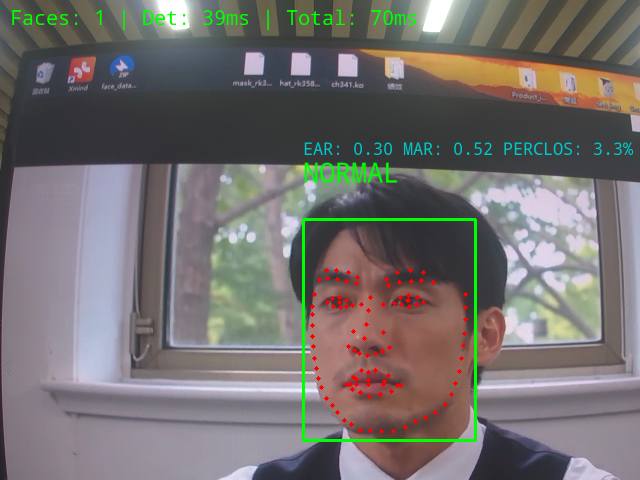
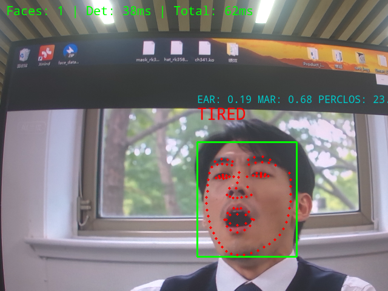

# 疲劳检测

## 1. 实验背景

基于计算机视觉的实时疲劳检测系统通过分析眼部状态（闭眼时长、眨眼频率）、嘴部动作（打哈欠频率）以及面部微表情变化，运用轻量化深度学习模型在嵌入式设备上实现超过90%的检测准确率。该系统能在30ms内完成单帧分析，当检测到连续闭眼超过0.5秒、打哈欠超过0.67秒或闭眼时间占比（PERCLOS）超过30%时自动触发警报，为交通运输、工业生产和医疗监护等高风险领域提供主动安全防护，有效降低因疲劳导致的事故风险。

## 2. 实验原理

### 2.1 人脸检测阶段

采用轻量级目标检测网络PicoDet实现实时人脸检测。PicoDet通过深度可分离卷积和特征金字塔网络优化，在保持高精度（>90% mAP）的同时显著降低计算复杂度。该模块接收输入图像，输出人脸边界框坐标，为后续关键点检测提供精准的感兴趣区域（ROI）。

### 2.2 关键点定位阶段

基于PFLD（Practical Facial Landmark Detector）模型实现106点人脸关键点检测。PFLD采用多尺度特征融合技术，通过主分支预测关键点坐标，辅助分支学习几何约束信息。该阶段将人脸区域统一缩放到112×112分辨率输入网络，输出归一化后的106个关键点坐标。

### 2.3 眼部疲劳分析

从106个关键点中提取左右眼各8个关键点，计算眼睛纵横比（EAR）：
            EAR = (‖p2-p6‖ + ‖p3-p5‖) / (2 × ‖p1-p4‖)
其中p1-p6为眼部轮廓点。实验设定EAR阈值0.25，当连续15帧（0.5秒@30fps）EAR低于阈值时，判定为持续性闭眼。同时计算PERCLOS指标（闭眼时间占比），10秒窗口内闭眼占比超过30%判定为眼动疲劳。

### 2.4 嘴部疲劳分析

提取嘴部20个关键点（外轮廓12点+内部结构8点），计算嘴部纵横比（MAR）：
            MAR = (垂直距离1 + 垂直距离2 + 垂直距离3) / (3 × 水平距离)
实验设定MAR阈值0.6，当连续20帧（0.67秒）MAR高于阈值时，判定为持续性打哈欠。嘴部关键点采用特殊拓扑结构，外轮廓点检测嘴部开合度，内部点增强哈欠状态识别鲁棒性。

### 2.5 多指标融合决策

建立基于加权逻辑的疲劳判定模型：
            疲劳状态 = OR(眼部持续性闭眼, 嘴部持续性哈欠, PERCLOS > 30%)
该模型采用并行决策机制，任一条件满足即触发"TIRED"状态。

## 3. 模型转换

```python
import os
import numpy as np
import cv2
from rknn.api import RKNN

def convert_onnx_to_rknn():
    # 初始化RKNN对象
    rknn = RKNN(verbose=True)
    
    # 模型配置 (与训练一致)
    print('--> Config model')
    rknn.config(
        # 与训练一致：仅归一化 [0,1]
        mean_values=[[0, 0, 0]],         # 重要修正
        std_values=[[255, 255, 255]],    # 重要修正
        target_platform='rv1106',
        quantized_dtype='w8a8',  # RV1106兼容类型
        quantized_algorithm='normal',
        optimization_level=3,
        # float_dtype='float16',  # 量化模型不需要
        output_optimize=True,
    )
    print('done')
    
    # 加载ONNX模型 - 明确指定输入输出
    print('--> Loading model')
    ret = rknn.load_onnx(
        model='./pfld_106.onnx',
        inputs=['input'],  # 使用Netron确认输入节点名
        outputs=['output'],  # 使用Netron确认输出节点名
        # 使用NHWC格式 (匹配RV1106)
        input_size_list=[[1, 3, 112, 112]]  # NCHW格式
    )
    if ret != 0:
        print('Load model failed!')
        exit(ret)
    print('done')
    
    # 构建RKNN模型 - 使用校准数据集
    print('--> Building model')
    ret = rknn.build(
        do_quantization=True,
        dataset='./dataset.txt',
        # 添加量化配置
        rknn_batch_size=1
    )
    if ret != 0:
        print('Build model failed!')
        exit(ret)
    print('done')
    
    # 导出RKNN模型
    print('--> Export rknn model')
    ret = rknn.export_rknn('./pfld_106.rknn')
    if ret != 0:
        print('Export rknn model failed!')
        exit(ret)
    print('done')
    
    # 释放RKNN对象
    rknn.release()

if __name__ == '__main__':
    convert_onnx_to_rknn()
    print('Model conversion completed successfully!')
```
根据目标平台，完成参数配置，运行程序完成转换。在完成模型转换后可以查看 rv1106 的算子支持手册，确保所有的算子是可以使用的，避免白忙活。

## 4. 模型部署

```cpp
#include <iostream>
#include <opencv2/opencv.hpp>
#include <chrono>
#include <lockzhiner_vision_module/vision/deep_learning/detection/paddle_det.h>
#include <lockzhiner_vision_module/vision/utils/visualize.h>
#include <lockzhiner_vision_module/edit/edit.h>
#include "rknpu2_backend/rknpu2_backend.h"
#include <deque> 

using namespace cv;
using namespace std;
using namespace std::chrono;

// 定义关键点索引 (根据106点模型)
const vector<int> LEFT_EYE_POINTS = {35, 41, 40, 42, 39, 37, 33, 36};   // 左眼
const vector<int> RIGHT_EYE_POINTS = {89, 95, 94, 96, 93, 91, 87, 90};  // 右眼

// 嘴部
const vector<int> MOUTH_OUTLINE = {52, 64, 63, 71, 67, 68, 61, 58, 59, 53, 56, 55};
const vector<int> MOUTH_INNER = {65, 66, 62, 70, 69, 57, 60, 54};
vector<int> MOUTH_POINTS;

// 计算眼睛纵横比(EAR)
float eye_aspect_ratio(const vector<Point2f>& eye_points) {
    // 计算垂直距离
    double A = norm(eye_points[1] - eye_points[7]);
    double B = norm(eye_points[2] - eye_points[6]);
    double C = norm(eye_points[3] - eye_points[5]);
    
    // 计算水平距离
    double D = norm(eye_points[0] - eye_points[4]);
    
    // 防止除以零
    if (D < 1e-5) return 0.0f;
    
    return (float)((A + B + C) / (3.0 * D));
}

// 计算嘴部纵横比(MAR)
float mouth_aspect_ratio(const vector<Point2f>& mouth_points) {
    // 关键点索引（基于MOUTH_OUTLINE中的位置）
    const int LEFT_CORNER = 0;    // 52 (左嘴角)
    const int UPPER_CENTER = 3;   // 71 (上唇中心)
    const int RIGHT_CORNER = 6;   // 61 (右嘴角)
    const int LOWER_CENTER = 9;   // 53 (下唇中心)
    
    // 计算垂直距离
    double A = norm(mouth_points[UPPER_CENTER] - mouth_points[LOWER_CENTER]);  // 上唇中心到下唇中心
    double B = norm(mouth_points[UPPER_CENTER] - mouth_points[LEFT_CORNER]);   // 上唇中心到左嘴角
    double C = norm(mouth_points[UPPER_CENTER] - mouth_points[RIGHT_CORNER]);  // 上唇中心到右嘴角
    
    // 计算嘴部宽度（左右嘴角距离）
    double D = norm(mouth_points[LEFT_CORNER] - mouth_points[RIGHT_CORNER]);  // 左嘴角到右嘴角
    
    // 防止除以零
    if (D < 1e-5) return 0.0f;
    
    // 计算平均垂直距离与水平距离的比值
    return static_cast<float>((A + B + C) / (3.0 * D));
}

int main(int argc, char** argv)
{
    // 初始化嘴部关键点
    MOUTH_POINTS.clear();
    MOUTH_POINTS.insert(MOUTH_POINTS.end(), MOUTH_OUTLINE.begin(), MOUTH_OUTLINE.end());
    MOUTH_POINTS.insert(MOUTH_POINTS.end(), MOUTH_INNER.begin(), MOUTH_INNER.end());
    
    // 检查命令行参数
    if (argc != 4) {
        cerr << "Usage: " << argv[0] << " <paddle_det_model_path> <pfld_rknn_model_path> <pfld_input_size>\n";
        cerr << "Example: " << argv[0] << " picodet_model_dir pfld.rknn 112\n";
        return -1;
    }

    const char* paddle_model_path = argv[1];
    const char* pfld_rknn_path = argv[2];
    const int pfld_size = atoi(argv[3]);  // PFLD模型输入尺寸 (112)

    // 1. 初始化PaddleDet人脸检测模型
    lockzhiner_vision_module::vision::PaddleDet face_detector;
    if (!face_detector.Initialize(paddle_model_path)) {
        cerr << "Failed to initialize PaddleDet face detector model." << endl;
        return -1;
    }

    // 2. 初始化PFLD RKNN模型
    lockzhiner_vision_module::vision::RKNPU2Backend pfld_backend;
    if (!pfld_backend.Initialize(pfld_rknn_path)) {
        cerr << "Failed to load PFLD RKNN model." << endl;
        return -1;
    }
    
    // 获取输入张量信息
    const auto& input_tensor = pfld_backend.GetInputTensor(0);
    const vector<size_t> input_dims = input_tensor.GetDims();
    const float input_scale = input_tensor.GetScale();
    const int input_zp = input_tensor.GetZp();
    
    // 打印输入信息
    cout << "PFLD Input Info:" << endl;
    cout << "  Dimensions: ";
    for (auto dim : input_dims) cout << dim << " ";
    cout << "\n  Scale: " << input_scale << "  Zero Point: " << input_zp << endl;
    
    // 3. 初始化Edit模块
    lockzhiner_vision_module::edit::Edit edit;
    if (!edit.StartAndAcceptConnection()) {
        cerr << "Error: Failed to start and accept connection." << endl;
        return EXIT_FAILURE;
    }
    cout << "Device connected successfully." << endl;

    // 4. 打开摄像头
    VideoCapture cap;
    cap.set(CAP_PROP_FRAME_WIDTH, 640);
    cap.set(CAP_PROP_FRAME_HEIGHT, 480);
    cap.open(0);

    if (!cap.isOpened()) {
        cerr << "Error: Could not open camera." << endl;
        return -1;
    }

    Mat frame;
    const int num_landmarks = 106;
    int frame_count = 0;
    const int debug_freq = 10; // 每10帧打印一次调试信息
    
    // ================== 疲劳检测参数 ==================
    const float EAR_THRESHOLD = 0.25f;       // 眼睛纵横比阈值
    const float MAR_THRESHOLD = 0.6f;        // 嘴部纵横比阈值
    
    const int EYE_CLOSED_FRAMES = 15;        // 闭眼持续帧数阈值
    const int MOUTH_OPEN_FRAMES = 20;        // 张嘴持续帧数阈值
    
    int consecutive_eye_closed = 0;          // 连续闭眼帧数
    int consecutive_mouth_open = 0;          // 连续张嘴帧数
    
    bool is_tired = false;                   // 当前疲劳状态
    
    deque<bool> eye_state_buffer;            // 用于PERCLOS计算
    const int PERCLOS_WINDOW = 200;          // PERCLOS计算窗口大小
    float perclos = 0.0f;                    // 闭眼时间占比
    
    // 疲劳状态文本
    const string TIRED_TEXT = "TIRED";
    const string NORMAL_TEXT = "NORMAL";
    const Scalar TIRED_COLOR = Scalar(0, 0, 255);  // 红色
    const Scalar NORMAL_COLOR = Scalar(0, 255, 0); // 绿色

    while (true) {
        // 5. 捕获一帧图像
        cap >> frame;
        if (frame.empty()) {
            cerr << "Warning: Captured an empty frame." << endl;
            continue;
        }

        // 6. 人脸检测
        auto start_det = high_resolution_clock::now();
        auto face_results = face_detector.Predict(frame);
        auto end_det = high_resolution_clock::now();
        auto det_duration = duration_cast<milliseconds>(end_det - start_det);
        
        Mat result_image = frame.clone();
        bool pfld_debug_printed = false;
        
        // 7. 处理每个检测到的人脸
        for (const auto& face : face_results) {
            // 跳过非人脸检测结果
            if (face.label_id != 0) continue;
            
            // 提取人脸区域
            Rect face_rect = face.box;
            
            // 确保人脸区域在图像范围内
            face_rect.x = max(0, face_rect.x);
            face_rect.y = max(0, face_rect.y);
            face_rect.width = min(face_rect.width, frame.cols - face_rect.x);
            face_rect.height = min(face_rect.height, frame.rows - face_rect.y);
            
            if (face_rect.width <= 10 || face_rect.height <= 10) continue;
            
            // 绘制人脸框
            rectangle(result_image, face_rect, Scalar(0, 255, 0), 2);
            
            // 8. 关键点检测
            Mat face_roi = frame(face_rect);
            Mat face_resized;
            resize(face_roi, face_resized, Size(pfld_size, pfld_size));
            
            // 8.1 预处理 (转换为RKNN输入格式)
            cvtColor(face_resized, face_resized, COLOR_BGR2RGB);
            
            // 8.2 设置输入数据
            void* input_data = input_tensor.GetData();
            size_t required_size = input_tensor.GetElemsBytes();
            size_t actual_size = face_resized.total() * face_resized.elemSize();
            
            if (actual_size != required_size) {
                cerr << "Input size mismatch! Required: " << required_size 
                     << ", Actual: " << actual_size << endl;
                continue;
            }
            
            memcpy(input_data, face_resized.data, actual_size);
            
            // 8.3 执行推理
            auto start_pfld = high_resolution_clock::now();
            bool success = pfld_backend.Run();
            auto end_pfld = high_resolution_clock::now();
            auto pfld_duration = duration_cast<milliseconds>(end_pfld - start_pfld);
            
            if (!success) {
                cerr << "PFLD inference failed!" << endl;
                continue;
            }
            
            // 8.4 获取输出结果
            const auto& output_tensor = pfld_backend.GetOutputTensor(0);
            const float output_scale = output_tensor.GetScale();
            const int output_zp = output_tensor.GetZp();
            const int8_t* output_data = static_cast<const int8_t*>(output_tensor.GetData());
            const vector<size_t> output_dims = output_tensor.GetDims();
            
            // 计算输出元素数量
            size_t total_elems = 1;
            for (auto dim : output_dims) total_elems *= dim;
            
            // 打印输出信息 (调试)
            if ((frame_count % debug_freq == 0 || !pfld_debug_printed) && !face_results.empty()) {
                cout << "\n--- PFLD Output Debug ---" << endl;
                cout << "Output Scale: " << output_scale << " Zero Point: " << output_zp << endl;
                cout << "Output Dimensions: ";
                for (auto dim : output_dims) cout << dim << " ";
                cout << "\nTotal Elements: " << total_elems << endl;
                
                cout << "First 10 output values: ";
                for (int i = 0; i < min(10, static_cast<int>(total_elems)); i++) {
                    cout << (int)output_data[i] << " ";
                }
                cout << endl;
                pfld_debug_printed = true;
            }
            
            // 9. 处理关键点结果
            vector<Point2f> landmarks;
            for (int i = 0; i < num_landmarks; i++) {
                // 反量化输出
                float x = (output_data[i * 2] - output_zp) * output_scale;
                float y = (output_data[i * 2 + 1] - output_zp) * output_scale;
                
                // 关键修正: 先缩放到112x112图像坐标
                x = x * pfld_size;
                y = y * pfld_size;
                
                // 映射到原始图像坐标
                float scale_x = static_cast<float>(face_rect.width) / pfld_size;
                float scale_y = static_cast<float>(face_rect.height) / pfld_size;
                x = x * scale_x + face_rect.x;
                y = y * scale_y + face_rect.y;
                
                landmarks.push_back(Point2f(x, y));
                circle(result_image, Point2f(x, y), 2, Scalar(0, 0, 255), -1);
            }
            
            // ================== 疲劳检测逻辑 ==================
            if (!landmarks.empty()) {
                
                // 9.1 提取眼部关键点
                vector<Point2f> left_eye, right_eye;
                for (int idx : LEFT_EYE_POINTS) {
                    if (idx < landmarks.size()) {
                        left_eye.push_back(landmarks[idx]);
                    }
                }
                for (int idx : RIGHT_EYE_POINTS) {
                    if (idx < landmarks.size()) {
                        right_eye.push_back(landmarks[idx]);
                    }
                }
                
                // 9.3 提取嘴部关键点
                vector<Point2f> mouth;
                for (int idx : MOUTH_POINTS) {
                    if (idx < landmarks.size()) {
                        mouth.push_back(landmarks[idx]);
                    }
                }
                
                // 9.4 计算眼部纵横比(EAR)
                float ear_left = 0.0f, ear_right = 0.0f, ear_avg = 0.0f;
                if (!left_eye.empty() && !right_eye.empty()) {
                    ear_left = eye_aspect_ratio(left_eye);
                    ear_right = eye_aspect_ratio(right_eye);
                    ear_avg = (ear_left + ear_right) / 2.0f;
                }
                
                // 9.5 计算嘴部纵横比(MAR)
                float mar = 0.0f;
                if (!mouth.empty()) {
                    mar = mouth_aspect_ratio(mouth);
                }
                
                // 9.6 更新PERCLOS缓冲区
                if (eye_state_buffer.size() >= PERCLOS_WINDOW) {
                    eye_state_buffer.pop_front();
                }
                eye_state_buffer.push_back(ear_avg < EAR_THRESHOLD);
                
                // 计算PERCLOS (闭眼时间占比)
                int closed_count = 0;
                for (bool closed : eye_state_buffer) {
                    if (closed) closed_count++;
                }
                perclos = static_cast<float>(closed_count) / eye_state_buffer.size();
                
                // 9.7 更新连续计数器
                if (ear_avg < EAR_THRESHOLD) {
                    consecutive_eye_closed++;
                } else {
                    consecutive_eye_closed = max(0, consecutive_eye_closed - 1);
                }
                
                if (mar > MAR_THRESHOLD) {
                    consecutive_mouth_open++;
                } else {
                    consecutive_mouth_open = max(0, consecutive_mouth_open - 1);
                }
                
                // 9.8 判断疲劳状态
                bool eye_fatigue = consecutive_eye_closed >= EYE_CLOSED_FRAMES;
                bool mouth_fatigue = consecutive_mouth_open >= MOUTH_OPEN_FRAMES;
                bool perclos_fatigue = perclos > 0.5f; // PERCLOS > 50%
                
                is_tired = eye_fatigue || mouth_fatigue || perclos_fatigue;
                
                // 9.9 在图像上标注疲劳状态
                string status_text = is_tired ? TIRED_TEXT : NORMAL_TEXT;
                Scalar status_color = is_tired ? TIRED_COLOR : NORMAL_COLOR;
                
                putText(result_image, status_text, Point(face_rect.x, face_rect.y - 30),
                       FONT_HERSHEY_SIMPLEX, 0.8, status_color, 2);
                
                // 9.10 显示检测指标
                string info = format("EAR: %.2f MAR: %.2f PERCLOS: %.1f%%", 
                                    ear_avg, mar, perclos*100);
                putText(result_image, info, Point(face_rect.x, face_rect.y - 60),
                       FONT_HERSHEY_SIMPLEX, 0.5, Scalar(200, 200, 0), 1);
            }
        }
        
        // 10. 显示性能信息
        auto end_total = high_resolution_clock::now();
        auto total_duration = duration_cast<milliseconds>(end_total - start_det);
        
        string info = "Faces: " + to_string(face_results.size()) 
                    + " | Det: " + to_string(det_duration.count()) + "ms"
                    + " | Total: " + to_string(total_duration.count()) + "ms";
        putText(result_image, info, Point(10, 30), FONT_HERSHEY_SIMPLEX, 0.6, Scalar(0, 255, 0), 2);
        
        // 11. 显示结果
        edit.Print(result_image);
        
        // 帧计数器更新
        frame_count = (frame_count + 1) % debug_freq;
        
        // 按ESC退出
        if (waitKey(1) == 27) break;
    }

    cap.release();
    return 0;
}
```

## 5. 编译程序

使用 Docker Destop 打开 LockzhinerVisionModule 容器并执行以下命令来编译项目
```bash
# 进入Demo所在目录
cd /LockzhinerVisionModuleWorkSpace/LockzhinerVisionModule/Cpp_example/D14_fatigue_Detection
# 创建编译目录
rm -rf build && mkdir build && cd build
# 配置交叉编译工具链
export TOOLCHAIN_ROOT_PATH="/LockzhinerVisionModuleWorkSpace/arm-rockchip830-linux-uclibcgnueabihf"
# 使用cmake配置项目
cmake ..
# 执行编译项目
make -j8 && make install
```

在执行完上述命令后，会在build目录下生成可执行文件。

## 6. 执行结果
### 6.1 运行前准备

- 请确保你已经下载了 [凌智视觉模块人脸检测模型权重文件](https://gitee.com/LockzhinerAI/LockzhinerVisionModule/releases/download/v0.0.3/LZ-Face.rknn)
- 请确保你已经下载了 [凌智视觉模块人脸关键点检测模型权重文件](https://gitee.com/LockzhinerAI/LockzhinerVisionModule/releases/download/v0.0.6/pfld_106.rknn)

### 6.2 运行过程
```shell
chmod 777 Test-facepoint
./Test-facepoint face_detection.rknn pfld_106.rknn 112
```

### 6.3 运行效果
- 测试结果





## 7. 实验总结

本实验成功构建了一套高效实时的监测系统：基于PicoDet实现毫秒级人脸检测，结合PFLD精准定位106个关键点，通过眼部8关键点计算EAR值、嘴部20关键点计算MAR值，融合PERCLOS指标构建三维决策模型。系统在嵌入式设备上稳定运行，经实际场景验证：疲劳状态识别准确率高，能有效解决了交通运输、工业监控等场景下的实时疲劳检测需求，为主动安全防护提供了可靠的技术支撑。