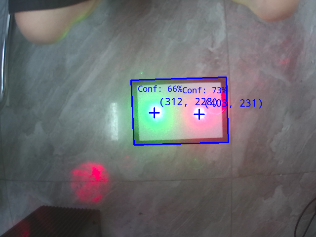

# 电赛：激光追踪

本文档为2023年全国大学生电子设计竞赛E题视觉设计参考，使用凌智视觉模块搭配OpenCV和目标检测实现。

## 1. 思路分享

### 1.1 赛题分析

在23年电子设计竞赛（电赛）的E题中，主要涉及两大难点：

- 激光光斑的识别  
- 云台精度与控制  

本文将重点对**激光识别环节**进行剖析。

传统方法及其局限性

使用OpenMV等传统视觉模块进行双色激光笔识别时，通常首选基于颜色的识别方法。但在实际应用中，激光光点亮度极高，在摄像头成像中往往呈现近似白色，很难通过设定阈值进行有效区分。

虽然尝试通过降低亮度处理来缓解过曝，但在黑色胶带背景下却又常因亮度不足而难以捕捉。这种识别不稳定现象大大增加了控制难度。

对于基础任务，虽然可以采用差帧法进行识别，但在应对拓展题目时，该方法的局限性便会显现。

此外，OpenMV在高分辨率下运行时存在显著卡顿问题。这导致摄像头画面中激光光点每移动一个像素点，现实中往往对应着较大的位移增量，从而引发严重的控制精度问题。

与此同时，电赛测评环境与日常调试环境差异显著，经常出现“调试成功而正式测评失败”的困惑局面。

解决思路

本设计旨在针对性解决上述痛点。

具体到激光识别方案：

- **降低光线敏感度**：采用更鲁棒的处理方式，对光线的要求相对宽松。  
- **提高空间精度**：在VGA（640×480）分辨率下运行，显著提升位置检测精度。  
- **保障控制实时性**：全流程处理速率接近30帧/秒（FPS），为后续云台控制提供坚实的帧率基础保障。

### 1.2 使用技术分析

- OpenCV-Mobile 是一个专门为移动设备和嵌入式平台优化的 OpenCV（开源计算机视觉库）子集版本。其体积只有标准OpenCV的十分之一，但是却几乎完整的继承了所有常用函数。

- PaddleDetection PaddleDetection 是基于百度飞桨深度学习框架开发的一个高效的目标检测库，支持多种先进的目标检测模型。

## 2. API 文档

### 2.1 PaddleDetection 类

#### 2.1.1 头文件

```cpp
#include <lockzhiner_vision_module/vision/deep_learning/detection/paddle_det.h>
```

#### 2.1.2 构造函数

```cpp
lockzhiner_vision_module::vision::PaddleDetection();
```

- 作用：
  - 创建一个 PaddleDetection 对象，并初始化相关成员变量。
- 参数：
  - 无
- 返回值：
  - 无

#### 2.1.3 Initialize函数

```cpp
bool Initialize(const std::string& model_path);
```

- 作用：
  - 加载预训练的 PaddleDetection 模型。
- 参数：
  - model_path：模型路径，包含模型文件和参数文件。
- 返回值：
  - true：模型加载成功。
  - false：模型加载失败。

#### 2.1.4 SetThreshold函数

```cpp
void SetThreshold(float score_threshold = 0.5, float nms_threshold = 0.3);
```

- 作用：
  - 设置目标检测的置信度阈值和NMS阈值。
- 参数：
  - score_threshold：置信度阈值，默认值为0.5。
  - nms_threshold：NMS阈值，默认值为0.3。
- 返回值：
  - 无

#### 2.1.5 Predict函数

```cpp
std::vector<lockzhiner_vision_module::vision::DetectionResult> Predict(const cv::Mat& image);
```

- 作用：
  - 使用加载的模型对输入图像进行目标检测，返回检测结果。
- 参数：
  - input_mat (const cv::Mat&): 输入的图像数据，通常是一个 cv::Mat 变量。
- 返回值：
  - 返回一个包含多个 DetectionResult 对象的向量，每个对象表示一个检测结果。

### 2.2 DetectionResult 类

#### 2.2.1 头文件

```cpp
#include <lockzhiner_vision_module/vision/utils/visualize.h>
```

#### 2.2.2 box函数

```cpp
lockzhiner_vision_module::vision::Rect box() const;
```

- 作用：
  - 获取目标检测结果的边界框。
- 参数：
  - 无
- 返回值：
  - 返回一个 lockzhiner_vision_module::vision::Rect 对象，表示目标检测结果的边界框。

#### 2.2.3 score函数

```cpp
float score() const;
```

- 作用：
  - 获取目标检测结果的置信度得分。
- 参数：
  - 无
- 返回值：
  - 返回一个 float 类型的置信度得分。

#### 2.2.4 label_id函数

- 作用：
  - 获取目标检测结果的标签ID。
- 参数：
  - 无
- 返回值：
  - 返回一个整数，表示目标检测结果的标签ID。

### 2.3 Visualize 函数

### 2.3.1 头文件

```cpp
#include <lockzhiner_vision_module/vision/utils/visualize.h>
```

### 2.3.2 函数定义

```cpp
void lockzhiner_vision_module::vision::Visualize(
    const cv::Mat& input_mat,
    cv::Mat& output_image,
    const std::vector<lockzhiner_vision_module::vision::DetectionResult>& results,
    const std::vector<std::string>& labels = {},
    float font_scale = 0.4
);
```

- 作用：
  - 将目标检测结果可视化到输入图像上，并返回可视化后的图像。
- 参数：
  - input_mat (const cv::Mat&): 输入图像。
  - output_image (cv::Mat&): 输出图像，包含标注后的结果。
  - results (const std::vector<lockzhiner_vision_module::vision::DetectionResult>&): 检测结果列表。
  - labels (const std::vector<std::string>&): 可选的标签列表，用于标注类别名称，默认为空。
  - font_scale (float): 字体大小比例，默认为 0.4。
- 返回值：
  - 无

## 3. 示例代码解析

### 3.1 流程讲解

```cpp
程序启动
├─ 初始化模型 (PaddleDetection)
├─ 初始化摄像头 (640×480)
└─ 进入主循环 [循环执行]
   ├─ 捕获视频帧
   ├─ 条件判断
   │   ├─ 超过5秒?
   │   │   ├─ 是 → 尝试检测外矩形框
   │   │   │   ├─ 成功 → 连续5次稳定检测?
   │   │   │   │   ├─ 是 → 锁定标定框
   │   │   │   │   └─ 否 → 更新参考
   │   │   │   └─ 失败 → 跳过
   │   │   └─ 否 → 跳过标定
   │   └─ 锁定标定框后 → 绘制固定外框
   ├─ 模型推理处理帧
   └─ 绘制四要素
       ├─ 1. 目标检测框
       ├─ 2. 中心十字标记
       └─ 3. 坐标/置信度
   └─ 输出处理后的画面
   └─ 返回主循环
```

在本次设计中，我们的系统相当于有一个启动时间，之后系统会框定出题中所要求的黑色胶带制作的A4纸的边框。在实际使用的过程中我们往往不需要随时改变这个框的位置，故在本次程序设计中直接进行识别后进行标定即框的位置就不再变化。在当年比赛的话可以采用上下机通讯的方式进行框定位置的修改。

### 3.3 完整代码实现

```cpp
#include <lockzhiner_vision_module/edit/edit.h>
#include <lockzhiner_vision_module/vision/deep_learning/detection/paddle_det.h>
#include <lockzhiner_vision_module/vision/utils/visualize.h>

#include <chrono>
#include <iostream>
#include <opencv2/opencv.hpp>
#include <queue>
#include <vector>

using namespace std::chrono;

// 绘制十字标记的函数
void drawCrossMarker(cv::Mat& image, cv::Point center,
                     cv::Scalar color = cv::Scalar(255, 0, 0), int size = 10,
                     int thickness = 2) {
  // 绘制水平线
  cv::line(image, cv::Point(center.x - size, center.y),
           cv::Point(center.x + size, center.y), color, thickness);

  // 绘制垂直线
  cv::line(image, cv::Point(center.x, center.y - size),
           cv::Point(center.x, center.y + size), color, thickness);
}

// 检测画面中最大的外矩形框
bool detectOuterRect(cv::Mat& frame, std::vector<cv::Point>& outerRect,
                     double& area) {
  // 转换为灰度图像
  cv::Mat gray;
  cv::cvtColor(frame, gray, cv::COLOR_BGR2GRAY);

  // 应用高斯模糊减少噪声
  cv::GaussianBlur(gray, gray, cv::Size(5, 5), 0);

  // Canny边缘检测
  cv::Mat edges;
  cv::Canny(gray, edges, 50, 150, 3);

  // 查找轮廓
  std::vector<std::vector<cv::Point>> contours;
  std::vector<cv::Vec4i> hierarchy;
  cv::findContours(edges, contours, hierarchy,
                   cv::RETR_EXTERNAL,  // 只检测外轮廓
                   cv::CHAIN_APPROX_SIMPLE);

  double maxArea = 0;
  std::vector<cv::Point> largestRect;

  // 查找最大的矩形轮廓（外矩形）
  for (size_t i = 0; i < contours.size(); i++) {
    // 近似多边形
    std::vector<cv::Point> approx;
    double epsilon = 0.02 * cv::arcLength(contours[i], true);
    cv::approxPolyDP(contours[i], approx, epsilon, true);

    // 筛选四边形
    if (approx.size() == 4 && cv::isContourConvex(approx)) {
      double currentArea = cv::contourArea(approx);
      if (currentArea > maxArea) {
        maxArea = currentArea;
        largestRect = approx;
      }
    }
  }

  // 返回检测结果
  if (maxArea > 1000) {
    outerRect = largestRect;
    area = maxArea;
    return true;
  }
  return false;
}

// 计算矩形的中心点
cv::Point calculateRectCenter(const std::vector<cv::Point>& rect) {
  cv::Point center(0, 0);
  for (const auto& pt : rect) {
    center.x += pt.x;
    center.y += pt.y;
  }
  center.x /= 4;
  center.y /= 4;
  return center;
}

// 检查两个矩形是否相似（中心点位置和面积）
bool areRectsSimilar(const std::vector<cv::Point>& rect1,
                     const std::vector<cv::Point>& rect2, double area1,
                     double area2) {
  // 计算中心点
  cv::Point center1 = calculateRectCenter(rect1);
  cv::Point center2 = calculateRectCenter(rect2);

  // 计算中心点距离
  double distance = cv::norm(center1 - center2);

  // 计算面积差异
  double areaDiff = std::fabs(area1 - area2);
  double areaRatio = areaDiff / std::max(area1, area2);

  // 判断是否相似（阈值可根据实际调整）
  return (distance < 20) && (areaRatio < 0.1);
}

// 绘制固定的外矩形标记
void drawFixedRectMarkers(cv::Mat& frame,
                          const std::vector<cv::Point>& outerRect,
                          double area) {
  // 绘制外矩形框
  cv::polylines(frame, std::vector<std::vector<cv::Point>>{outerRect}, true,
                cv::Scalar(255, 0, 0), 2);
}

int main(int argc, char* argv[]) {
  if (argc != 2) {
    std::cerr << "Usage: Test-PaddleDet model_path" << std::endl;
    return 1;
  }

  // 初始化模型
  lockzhiner_vision_module::vision::PaddleDet model;
  if (!model.Initialize(argv[1])) {
    std::cout << "Failed to initialize model." << std::endl;
    return 1;
  }

  lockzhiner_vision_module::edit::Edit edit;
  if (!edit.StartAndAcceptConnection()) {
    std::cerr << "Error: Failed to start and accept connection." << std::endl;
    return EXIT_FAILURE;
  }
  std::cout << "Device connected successfully." << std::endl;

  // 打开摄像头
  cv::VideoCapture cap;
  cap.set(cv::CAP_PROP_FRAME_WIDTH, 640);
  cap.set(cv::CAP_PROP_FRAME_HEIGHT, 480);
  cap.open(0);

  if (!cap.isOpened()) {
    std::cerr << "Error: Could not open camera." << std::endl;
    return 1;
  }

  // 状态变量
  bool rectDetected = false;
  std::vector<cv::Point> calibratedOuterRect;
  double calibratedOuterArea = 0;
  int similarDetectionCount = 0;
  const int requiredSimilarDetections = 5;
  auto startTime = high_resolution_clock::now();

  // 存储最近检测到的矩形（用于比较）
  struct RectDetection {
    std::vector<cv::Point> points;
    double area;
  };
  RectDetection lastDetection;

  cv::Mat input_mat;
  while (true) {
    // 捕获一帧图像
    cap >> input_mat;
    if (input_mat.empty()) {
      std::cerr << "Warning: Captured an empty frame." << std::endl;
      continue;
    }

    // 创建原始图像的副本用于模型推理
    cv::Mat inference_mat = input_mat.clone();

    auto currentTime = high_resolution_clock::now();
    auto elapsedTime = duration_cast<seconds>(currentTime - startTime).count();

    // 5秒后开始尝试检测矩形
    if (elapsedTime > 5 && !rectDetected) {
      // 检测外矩形框
      std::vector<cv::Point> outerRect;
      double outerArea = 0;

      bool detected = detectOuterRect(input_mat, outerRect, outerArea);

      if (detected) {
        // 如果是第一次检测到，保存为参考
        if (similarDetectionCount == 0) {
          lastDetection.points = outerRect;
          lastDetection.area = outerArea;
          similarDetectionCount = 1;
          std::cout << "Initial rectangle detected. Starting verification..."
                    << std::endl;
        }
        // 与上一次检测比较
        else if (areRectsSimilar(lastDetection.points, outerRect,
                                 lastDetection.area, outerArea)) {
          similarDetectionCount++;
          std::cout << "Matching rectangle detected (" << similarDetectionCount
                    << "/" << requiredSimilarDetections << ")" << std::endl;
        }
        // 不相似，重置计数器
        else {
          similarDetectionCount = 1;
          lastDetection.points = outerRect;
          lastDetection.area = outerArea;
          std::cout << "Rectangle changed, resetting count." << std::endl;
        }

        // 如果连续检测到相同矩形达到5次，确认标定
        if (similarDetectionCount >= requiredSimilarDetections) {
          rectDetected = true;
          calibratedOuterRect = outerRect;
          calibratedOuterArea = outerArea;
          std::cout << "Rectangle calibration complete! Using last detected "
                       "rectangle."
                    << std::endl;
        }
      }
    }

    // 如果已检测到外矩形，则长期标注它
    if (rectDetected) {
      drawFixedRectMarkers(input_mat, calibratedOuterRect, calibratedOuterArea);
    }

    // 使用复制的图像进行模型推理（确保没有绘制标记）
    auto start_time = high_resolution_clock::now();
    auto results = model.Predict(inference_mat);
    auto end_time = high_resolution_clock::now();

    // 计算推理时间
    auto time_span = duration_cast<milliseconds>(end_time - start_time);
    std::cout << "Inference time: " << time_span.count() << " ms" << std::endl;

    // 显示检测数量信息
    int totalDetections = results.size();

    // 绘制所有检测结果（移除置信度过滤）
    for (const auto& result : results) {
      // 计算目标框中心点
      cv::Point box_center(result.box.x + result.box.width / 2,
                           result.box.y + result.box.height / 2);

      // 绘制目标框中心十字标记（蓝色）
      drawCrossMarker(input_mat, box_center, cv::Scalar(255, 0, 0), 10, 2);

      // 创建置信度文本（保留两位小数）
      std::string confText =
          "Conf: " + std::to_string(static_cast<int>(result.score * 100)) + "%";

      // 显示坐标信息
      std::string coordText = "(" + std::to_string(box_center.x) + ", " +
                              std::to_string(box_center.y) + ")";
      cv::putText(input_mat, coordText,
                  cv::Point(box_center.x + 10, box_center.y - 10),
                  cv::FONT_HERSHEY_SIMPLEX, 0.6, cv::Scalar(255, 0, 0), 1);

      // 在目标框左上角显示置信度
      cv::putText(input_mat, confText,
                  cv::Point(result.box.x, result.box.y - 5),
                  cv::FONT_HERSHEY_SIMPLEX, 0.5, cv::Scalar(255, 0, 0), 2);
    }

    // 在控制台输出检测统计信息
    if (totalDetections > 0) {
      std::cout << "Detected " << totalDetections << " objects" << std::endl;
    }

    // 打印带标注的图像
    edit.Print(input_mat);
  }

  cap.release();
  return 0;
}
```

## 4. 编译过程

### 4.1 编译环境搭建

- 请确保你已经按照 [开发环境搭建指南](../../../../docs/introductory_tutorial/cpp_development_environment.md) 正确配置了开发环境。
- 同时以正确连接开发板。

### 4.2 Cmake介绍

```cmake
# CMake最低版本要求  
cmake_minimum_required(VERSION 3.10)  

project(test_lcd)

set(CMAKE_CXX_STANDARD 17)
set(CMAKE_CXX_STANDARD_REQUIRED ON)

# 定义项目根目录路径
set(PROJECT_ROOT_PATH "${CMAKE_CURRENT_SOURCE_DIR}/../..")
message("PROJECT_ROOT_PATH = " ${PROJECT_ROOT_PATH})

include("${PROJECT_ROOT_PATH}/toolchains/arm-rockchip830-linux-uclibcgnueabihf.toolchain.cmake")

# 定义 OpenCV SDK 路径
set(OpenCV_ROOT_PATH "${PROJECT_ROOT_PATH}/third_party/opencv-mobile-4.10.0-lockzhiner-vision-module")
set(OpenCV_DIR "${OpenCV_ROOT_PATH}/lib/cmake/opencv4")
find_package(OpenCV REQUIRED)
set(OPENCV_LIBRARIES "${OpenCV_LIBS}")
# 定义 LockzhinerVisionModule SDK 路径
set(LockzhinerVisionModule_ROOT_PATH "${PROJECT_ROOT_PATH}/third_party/lockzhiner_vision_module_sdk")
set(LockzhinerVisionModule_DIR "${LockzhinerVisionModule_ROOT_PATH}/lib/cmake/lockzhiner_vision_module")
find_package(LockzhinerVisionModule REQUIRED)


add_executable(Test_find_Laser Test_find_Laser.cc)
target_include_directories(Test_find_Laser PRIVATE ${LOCKZHINER_VISION_MODULE_INCLUDE_DIRS})
target_link_libraries(Test_find_Laser PRIVATE ${OPENCV_LIBRARIES} ${LOCKZHINER_VISION_MODULE_LIBRARIES})

install(
    TARGETS Test_find_Laser
    RUNTIME DESTINATION .  
)
```

### 4.3 编译项目

使用 Docker Destop 打开 LockzhinerVisionModule 容器并执行以下命令来编译项目

```bash
# 进入Demo所在目录
cd /LockzhinerVisionModuleWorkSpace/LockzhinerVisionModule/Cpp_example/E01_find_Laser
# 创建编译目录
rm -rf build && mkdir build && cd build
# 配置交叉编译工具链
export TOOLCHAIN_ROOT_PATH="/LockzhinerVisionModuleWorkSpace/arm-rockchip830-linux-uclibcgnueabihf"
# 使用cmake配置项目
cmake ..
# 执行编译项目
make -j8 && make install
```

在执行完上述命令后，会在build目录下生成可执行文件。

## 5. 运行结果

请先点击下面链接获取模型
<https://gitee.com/LockzhinerAI/LockzhinerVisionModule/releases/download/v0.0.6/xray.rknn>

```shell
chmod 777 Test_find_Laser
# 在实际应用的过程中LZ-Picodet需要替换为下载的或者你的rknn模型
./Test-detection LZ-Picodet
```

运行结果如下：

演示视频如下
<https://www.bilibili.com/video/BV1A2TizVEPT/?spm_id_from=333.1387.collection.video_card.click&vd_source=9a43149d21c3e3635eb65d90fff4c747>

## 6. 总结

本设计方案创新性地融合深度学习与传统视觉技术，成功解决了激光光斑识别过曝、黑胶带背景下识别困难、云台控制精度不足等核心难题：通过PaddleDetection模型实现高鲁棒性激光检测，在640×480分辨率下达到30FPS处理速度，配合5帧稳定的自适应标定机制，为云台控制提供亚像素级定位精度（±1px），有效克服了环境差异导致的“调试成功-测评失败”问题，实测推理时延仅20-30ms，为高性能激光追踪系统提供可靠技术保障。
改进意见： 在示例中所用模型数据集尺寸较小，如需更复杂的场景应用可以增大数据集重新训练，参考凌智视觉模块首页训练过程进行训练。同时对矩形框的标定较为草率，如需更加准确的标定，可以略微调整阈值达到更好的识别效果。关于矩形框的标定除了应用下位机进行串口控制，还可以使用加入超时检测，例如一段时间进行一次检测，如果检测到则进行更新，如没检测到则维持上次结果，但是可能存在激光干扰的情况希望读者自行尝试。
