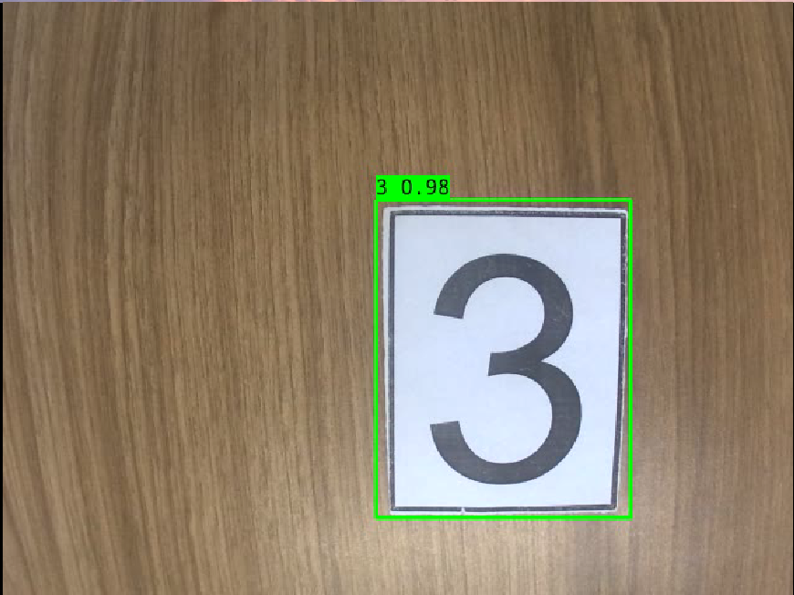

# 电赛：数字识别

本文档为2021年全国大学生电子设计竞赛F题数字识别参考，使用凌智视觉模块搭配OpenCV和目标检测实现。

## 1. 思路分享

### 1.1 赛题分析

在21年电子设计竞赛(电赛)的F题钟，主要涉及两大难点：

- 完成对红线的循迹
- 对打印数字的识别

其中红线循迹有多种方法进行实现，可以使用RGB传感器识别颜色进行实现，也可以使用凌智视觉模块实现一个模块完成全部任务，当然对机械安装角度有一定要求。

本文将重点对**打印数字识别**进行剖析。

传统方法及其局限性

使用OpenMV等传统视觉模块进行数字识别的话，不可避免的使用多模板匹配。但是根据OpenMV的文档可知多模板匹配本身就是一个试用功能，其中的帧率和准确率显然是无法保证的。在一个数字使用10张极小的模板时，OpenMV的帧率仅有5帧左右，且分辨率及其感人。在完成基础题的远端任务的时候，会出现识别效率不高导致超时或走错的情况，同时因为，模板匹配的固有缺点，会误识别6和8，7和1，还有将其中拐角识别成数字7等奇奇怪怪的问题。虽可以通过调整ROI和反复采集模板匹配来尽可能规避这些情况发生。但是在电赛这种比赛节奏紧张的比赛中。无疑是对参赛队员心里的一种莫大折磨。同时模板匹配对角度苛刻的要求也要求队员在封箱的过程中不能有一点震动，否则都可能会前功尽弃。

解决思路

本设计旨在针对性解决上述痛点。

具体到打印数字的识别方案上：

- **降低对识别角度的要求**：使用神经网络进行目标检测，大大降低对光线和角度的要求。
- **大大提高识别准确率**：使用预训练模型进行推理时，平均准确率高达99%。
- **更高的分辨率**：在VGA（640*480）分辨率下流畅运行，远远超过OpenMV的帧率和分辨率。

### 1.2 使用技术分析

- OpenCV-Mobile 是一个专门为移动设备和嵌入式平台优化的 OpenCV（开源计算机视觉库）子集版本。其体积只有标准OpenCV的十分之一，但是却几乎完整的继承了所有常用函数。

- PaddleDetection PaddleDetection 是基于百度飞桨深度学习框架开发的一个高效的目标检测库，支持多种先进的目标检测模型。

## 2. API 文档

### 2.1 PaddleDetection 类

#### 2.1.1 头文件

```cpp
#include <lockzhiner_vision_module/vision/deep_learning/detection/paddle_det.h>
```

#### 2.1.2 构造函数

```cpp
lockzhiner_vision_module::vision::PaddleDetection();
```

- 作用：
  - 创建一个 PaddleDetection 对象，并初始化相关成员变量。
- 参数：
  - 无
- 返回值：
  - 无

#### 2.1.3 Initialize函数

```cpp
bool Initialize(const std::string& model_path);
```

- 作用：
  - 加载预训练的 PaddleDetection 模型。
- 参数：
  - model_path：模型路径，包含模型文件和参数文件。
- 返回值：
  - true：模型加载成功。
  - false：模型加载失败。

#### 2.1.4 SetThreshold函数

```cpp
void SetThreshold(float score_threshold = 0.5, float nms_threshold = 0.3);
```

- 作用：
  - 设置目标检测的置信度阈值和NMS阈值。
- 参数：
  - score_threshold：置信度阈值，默认值为0.5。
  - nms_threshold：NMS阈值，默认值为0.3。
- 返回值：
  - 无

#### 2.1.5 Predict函数

```cpp
std::vector<lockzhiner_vision_module::vision::DetectionResult> Predict(const cv::Mat& image);
```

- 作用：
  - 使用加载的模型对输入图像进行目标检测，返回检测结果。
- 参数：
  - input_mat (const cv::Mat&): 输入的图像数据，通常是一个 cv::Mat 变量。
- 返回值：
  - 返回一个包含多个 DetectionResult 对象的向量，每个对象表示一个检测结果。

### 2.2 DetectionResult 类

#### 2.2.1 头文件

```cpp
#include <lockzhiner_vision_module/vision/utils/visualize.h>
```

#### 2.2.2 box函数

```cpp
lockzhiner_vision_module::vision::Rect box() const;
```

- 作用：
  - 获取目标检测结果的边界框。
- 参数：
  - 无
- 返回值：
  - 返回一个 lockzhiner_vision_module::vision::Rect 对象，表示目标检测结果的边界框。

#### 2.2.3 score函数

```cpp
float score() const;
```

- 作用：
  - 获取目标检测结果的置信度得分。
- 参数：
  - 无
- 返回值：
  - 返回一个 float 类型的置信度得分。

#### 2.2.4 label_id函数

- 作用：
  - 获取目标检测结果的标签ID。
- 参数：
  - 无
- 返回值：
  - 返回一个整数，表示目标检测结果的标签ID。

## 3. 示例代码解析

### 3.1 流程讲解

```cpp
main()
├── 检查命令行参数
│   └── 若参数数量不正确，输出使用说明并退出
├── 初始化PaddleDet模型
│   └── 若初始化失败，输出错误信息并退出
├── 启动编辑器(Edit)并尝试连接设备
│   └── 若连接失败，输出错误信息并退出
├── 设置摄像头属性并打开视频捕获设备
│   └── 若无法打开设备，输出错误信息并退出
└── 进入无限循环
    ├── 从摄像头捕获帧
    │   └── 如果捕获的帧为空，输出警告并继续下一循环
    ├── 使用模型进行推理
    │   ├── 记录开始时间
    │   ├── 执行预测
    │   ├── 记录结束时间
    │   └── 输出推理所耗时间
    ├── 根据推理结果绘制检测框及标签
    │   ├── 对每个检测结果
    │   │   ├── 映射label_id到实际标签
    │   │   ├── 绘制矩形框
    │   │   ├── 构造显示文本（包括标签和置信度）
    │   │   ├── 设置字体样式、大小、厚度
    │   │   ├── 获取文本大小并计算文本背景区域
    │   │   ├── 填充文本背景
    │   │   └── 在图像上绘制文本
    └── 将处理后的图像发送到设备显示
```

在本次设计中，我们的系统仅聚焦于如何识别打印数字，在识别后我们会在图像上打印出对应的识别框和识别结果。

### 3.2 完整代码实现

```cpp
#include <lockzhiner_vision_module/edit/edit.h>
#include <lockzhiner_vision_module/vision/deep_learning/detection/paddle_det.h>

#include <chrono>
#include <iostream>
#include <opencv2/opencv.hpp>

using namespace std::chrono;

int main(int argc, char *argv[]) {
  if (argc != 2) {
    std::cerr << "Usage: Test-PaddleDet model_path" << std::endl;
    return 1;
  }

  // 初始化模型
  lockzhiner_vision_module::vision::PaddleDet model;
  if (!model.Initialize(argv[1])) {
    std::cout << "Failed to initialize model." << std::endl;
    return 1;
  }

  lockzhiner_vision_module::edit::Edit edit;
  if (!edit.StartAndAcceptConnection()) {
    std::cerr << "Error: Failed to start and accept connection." << std::endl;
    return EXIT_FAILURE;
  }
  std::cout << "Device connected successfully." << std::endl;

  // 打开摄像头
  cv::VideoCapture cap;
  cap.set(cv::CAP_PROP_FRAME_WIDTH, 640);
  cap.set(cv::CAP_PROP_FRAME_HEIGHT, 480);

  if (!cap.open(0)) {
    std::cerr << "Couldn't open video capture device" << std::endl;
    return -1;
  }

  cv::Mat input_mat;

  // 定义标签映射表
  const std::vector<std::string> label_map = {"5", "8", "4", "3",
                                              "7", "6", "2", "1"};

  while (true) {
    cap >> input_mat;
    if (input_mat.empty()) {
      std::cerr << "Warning: Captured an empty frame." << std::endl;
      continue;
    }

    // 推理
    high_resolution_clock::time_point start_time = high_resolution_clock::now();
    auto results = model.Predict(input_mat);
    high_resolution_clock::time_point end_time = high_resolution_clock::now();

    auto time_span = duration_cast<milliseconds>(end_time - start_time);
    std::cout << "Inference time: " << time_span.count() << " ms" << std::endl;

    // 手动绘制检测结果
    cv::Mat output_image = input_mat.clone();  // 复制原始图像用于绘制

    for (const auto &result : results) {
      int label_id = result.label_id;
      float score = result.score;
      cv::Rect bbox = result.box;

      // 映射 label_id 到实际标签
      std::string label =
          (label_id >= 0 && label_id < static_cast<int>(label_map.size()))
              ? label_map[label_id]
              : "unknown";

      // 绘制矩形框
      cv::rectangle(output_image, bbox, cv::Scalar(0, 255, 0), 2);  // 绿色框

      // 构造显示文本
      std::string text = label + " " + cv::format("%.2f", score);

      // 设置字体
      int font_face = cv::FONT_HERSHEY_SIMPLEX;
      double font_scale = 0.5;
      int thickness = 1;

      // 获取文本大小
      int baseline;
      cv::Size text_size =
          cv::getTextSize(text, font_face, font_scale, thickness, &baseline);

      // 计算文本背景区域
      cv::Rect text_rect(bbox.x, bbox.y - text_size.height, text_size.width,
                         text_size.height + baseline);
      text_rect &=
          cv::Rect(0, 0, output_image.cols, output_image.rows);  // 避免越界

      // 填充文本背景
      cv::rectangle(output_image, text_rect, cv::Scalar(0, 255, 0), cv::FILLED);

      // 绘制文本
      cv::putText(output_image, text, cv::Point(bbox.x, bbox.y), font_face,
                  font_scale,
                  cv::Scalar::all(0),  // 黑色文字
                  thickness, 8);
    }

    // 发送到设备显示
    edit.Print(output_image);
  }

  cap.release();
  return 0;
}
```

## 4. 编译过程

### 4.1 编译环境搭建

- 请确保你已经按照 [开发环境搭建指南](../../../../docs/introductory_tutorial/cpp_development_environment.md) 正确配置了开发环境。
- 同时以正确连接开发板。

### 4.2 Cmake介绍

```cmake
 cmake_minimum_required(VERSION 3.10)

project(D01_test_detection)

set(CMAKE_CXX_STANDARD 17)
set(CMAKE_CXX_STANDARD_REQUIRED ON)

# 定义项目根目录路径
set(PROJECT_ROOT_PATH "${CMAKE_CURRENT_SOURCE_DIR}/../..")
message("PROJECT_ROOT_PATH = " ${PROJECT_ROOT_PATH})

include("${PROJECT_ROOT_PATH}/toolchains/arm-rockchip830-linux-uclibcgnueabihf.toolchain.cmake")

# 定义 OpenCV SDK 路径
set(OpenCV_ROOT_PATH "${PROJECT_ROOT_PATH}/third_party/opencv-mobile-4.10.0-lockzhiner-vision-module")
set(OpenCV_DIR "${OpenCV_ROOT_PATH}/lib/cmake/opencv4")
find_package(OpenCV REQUIRED)
set(OPENCV_LIBRARIES "${OpenCV_LIBS}")

# 定义 LockzhinerVisionModule SDK 路径
set(LockzhinerVisionModule_ROOT_PATH "${PROJECT_ROOT_PATH}/third_party/lockzhiner_vision_module_sdk")
set(LockzhinerVisionModule_DIR "${LockzhinerVisionModule_ROOT_PATH}/lib/cmake/lockzhiner_vision_module")
find_package(LockzhinerVisionModule REQUIRED)

add_executable(Test-number test_find_number.cc)
target_include_directories(Test-number PRIVATE ${LOCKZHINER_VISION_MODULE_INCLUDE_DIRS})
target_link_libraries(Test-number PRIVATE ${OPENCV_LIBRARIES} ${LOCKZHINER_VISION_MODULE_LIBRARIES})

install(
    TARGETS Test-number
    RUNTIME DESTINATION .  
)
```

### 4.3 编译项目

使用 Docker Destop 打开 LockzhinerVisionModule 容器并执行以下命令来编译项目

```bash
# 进入Demo所在目录
cd /LockzhinerVisionModuleWorkSpace/LockzhinerVisionModule/Cpp_example/E01_find_number
# 创建编译目录
rm -rf build && mkdir build && cd build
# 配置交叉编译工具链
export TOOLCHAIN_ROOT_PATH="/LockzhinerVisionModuleWorkSpace/arm-rockchip830-linux-uclibcgnueabihf"
# 使用cmake配置项目
cmake ..
# 执行编译项目
make -j8 && make install
```

在执行完上述命令后，会在build目录下生成可执行文件。

## 5. 运行结果

请先点击下面链接获取模型
<https://gitee.com/LockzhinerAI/LockzhinerVisionModule/releases/download/v0.0.6/digital.rknn>

```shell
chmod 777 Test-number
# 在实际应用的过程中LZ-Picodet需要替换为下载的或者你的rknn模型
./Test-number LZ-Picodet
```

运行结果如下：


## 6.总结

本文提出了一种基于凌智视觉模块与PaddleDetection的高效数字识别方案，相较于OpenMV等传统模板匹配方法展现出显著优势：采用神经网络目标检测模型实现平均99%的高识别精度，有效解决了6/8、7/1等易混淆数字的识别难题；大幅降低对光线条件和摄像头角度的敏感度，无需精密机械校准即可稳定工作；在640×480分辨率下保持毫秒级推理速度，帧率远超传统方案，完美契合电赛实时性要求。该方案通过PaddleDet模型与轻量化OpenCV-Mobile的协同，构建了完整的嵌入式数字识别系统，在2021年全国大学生电子设计竞赛实践中证实其能可靠解决F题核心难点，为参赛队伍提供了高效的识别解决方案。

- 改进意见：使用者可根据自己的使用环境，根据例程添加串口传输功能和巡线等一系列功能。
